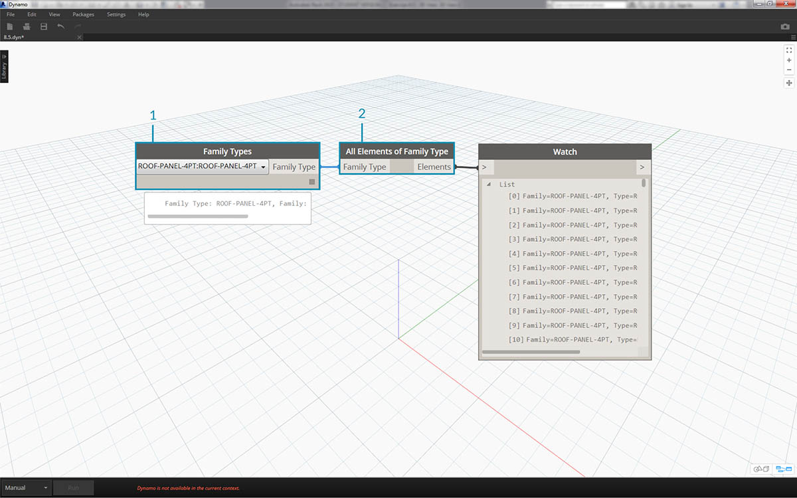
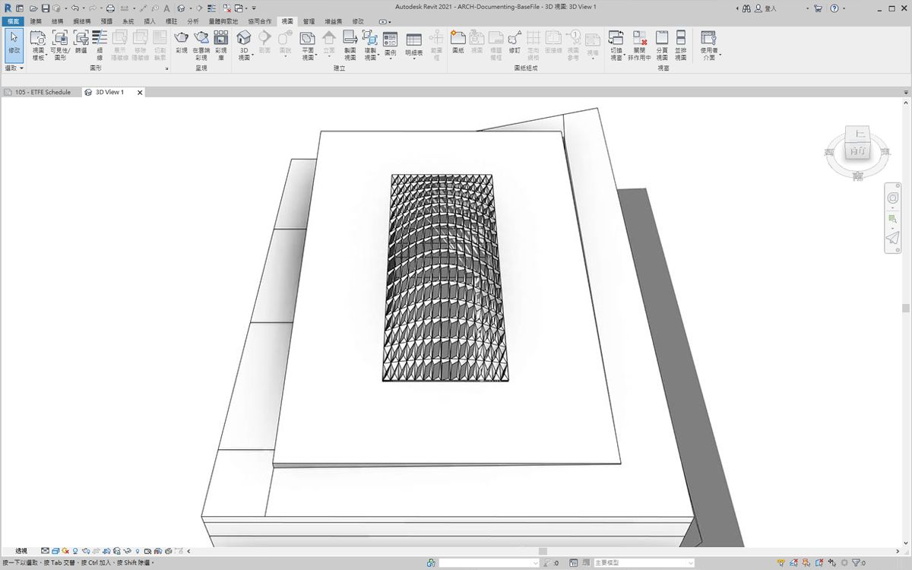
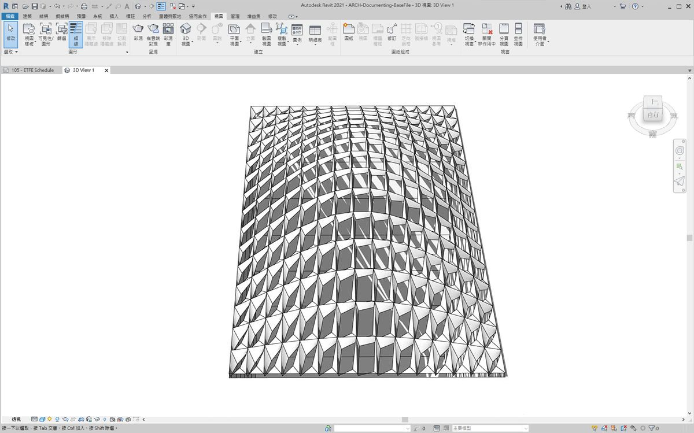
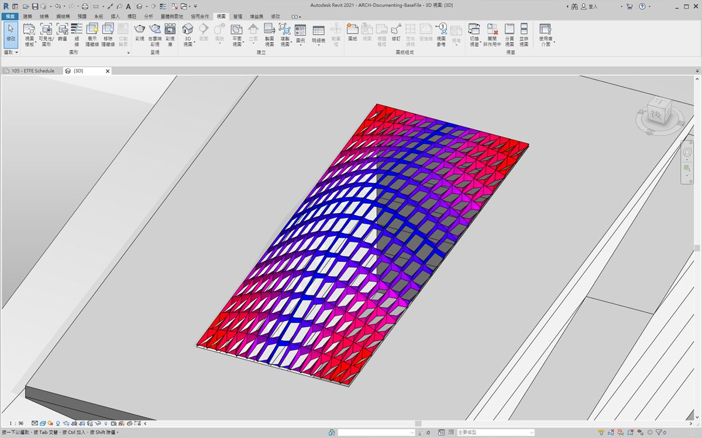
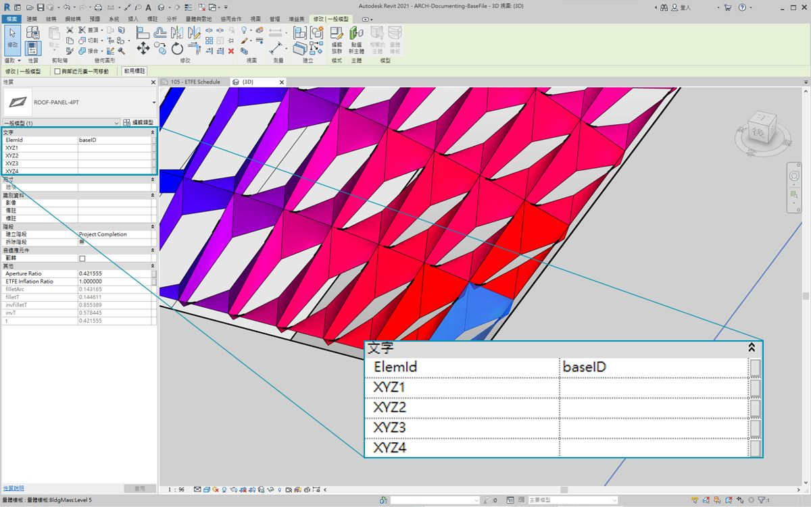
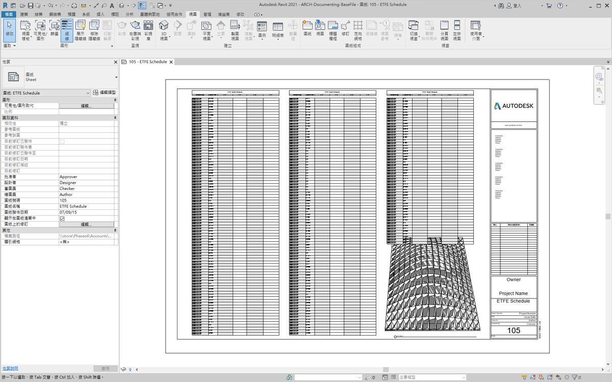
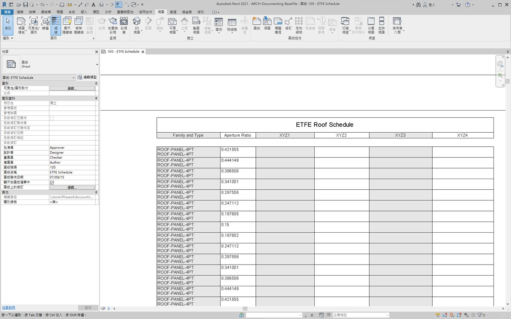
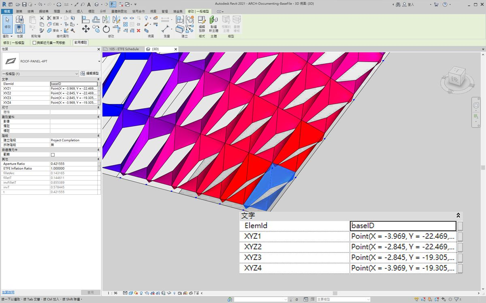
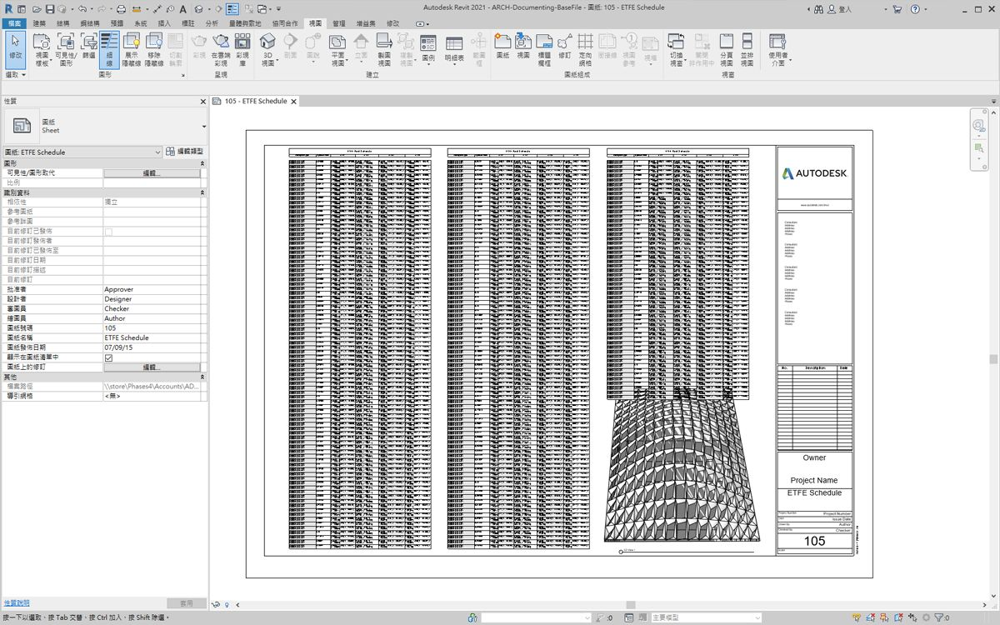
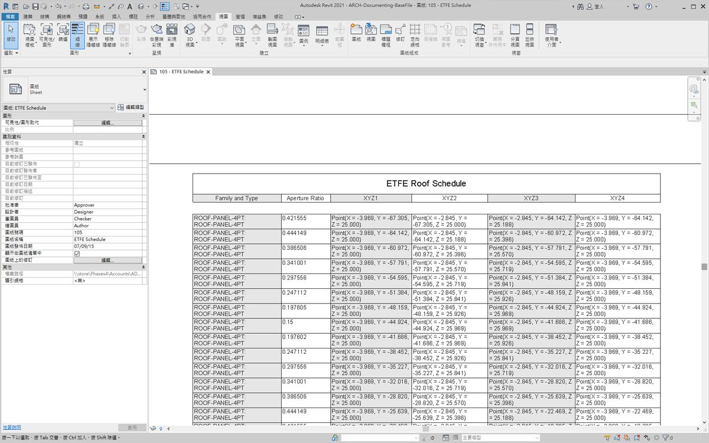

## 記錄

編輯文件的參數將遵循先前諸節學習的課程。在本節中，我們將瞭解編輯參數，這些參數不會影響元素的幾何性質，而是會準備供記錄的 Revit 檔案。

#### 偏差

在以下練習中，我們將使用平面節點的基本偏差，以建立供記錄的 Revit 圖紙。在以參數式方式定義的屋頂結構上，每個面板都具有不同的偏差值，我們希望透過使用顏色以及安排向正面顧問、工程師或承包商傳輸的自適應點，來呼叫值的範圍。


> 平面節點的偏差將計算一組四個點與各點之間最佳擬合平面的距離。這是快速輕鬆的建構研究方式。

### 練習

> 下載此練習隨附的範例檔案 (按一下右鍵，然後按一下「連結另存為...」)。附錄中提供範例檔案的完整清單。

> 1. [Documenting.dyn](datasets/8-6/Documenting.dyn)
2. [ARCH-Documenting-BaseFile.rvt](datasets/8-6/ARCH-Documenting-BaseFile.rvt)

從本節的 Revit 檔案開始 (或繼續使用上一節課的檔案)。此檔案的屋頂上具有一系列 ETFE 面板。我們在此練習中會參考這些面板。



> 1. 加入 *Family Types* 節點至圖元區，然後選擇*「ROOF-PANEL-4PT」*。
2. 將此節點插入至特定 *All Elements of Family Type* 節點，以便將 Revit 的所有元素匯入至 Dynamo。


> 1. 使用 *AdaptiveComponent.Locations* 節點查詢每個元件的自適應點的位置。
2. 使用 *Polygon.ByPoints* 節點從這四點建立多邊形。請注意，現在我們已在 Dynamo 中建立抽象版本的面板化系統，而無需匯入 Revit 元素的完整幾何圖形。
3. 使用 *Polygon.PlaneDeviation* 節點計算平面偏差。


> 就像上一個練習一樣，只是為了好玩，接下來我們根據平面偏差設定每個面板的*孔徑比*。

> 1. 加入 *Element.SetParameterByName* 節點至圖元區，並將自適應元件連接至 *element* 輸入。將名為 *「Aperture Ratio」* 的 *code block* 連接至 *parameterName* 輸入。
2. 我們無法將偏差結果直接連接至值輸入，因為需要將值重新對映至參數範圍。


> 1. 使用 *Math.RemapRange*，將偏差值重新對映至從 *0.15* 至 *0.45* 之間的範圍。
2. 將這些結果重新插入至 *Element.SetParameterByName* 的值輸入。



> 回到 Revit，我們會*稍微*理解曲面上鎖點框的變更。



> 拉近時，可以更清晰地看到封閉面板偏重於曲面的轉角。開放轉角朝向頂部。轉角代表偏差較大的區域，而凸度具有最小的曲率，因此這合乎邏輯。

### 顏色與文件

設定孔徑比不會清楚展示屋頂上面板的偏差，我們還要變更實際元素的幾何圖形。假設我們只希望研究製造可行性樁號的偏差。根據記錄的偏差範圍對面板上色會很有幫助。我們可以採用與上述步驟非常相似的程序，透過以下一系列步驟實現這一點。


> 1. 移除 *Element.SetParameterByName* 節點，然後加入 *Element.OverrideColorInView*。
2. 加入 *Color Range* 節點至圖元區，並插入至 *Element.OverrideColorInView* 的顏色輸入。我們仍必須將偏差值連接至顏色範圍，以建立漸層。
3. 將游標懸停在 *value* 輸入上，我們可以看到輸入的值必須介於 *0* 與 *1* 之間，才能將顏色對映至每個值。我們需要將偏差值重新對映至此範圍。


> 1. 使用 *Math.RemapRange*，將平面偏差值重新對映至介於 *0* 與 *1* 之間的範圍 (注意：您也可以使用*「MapTo」*節點來定義來源範圍)。
2. 將結果插入至 *Color Range* 節點。
3. 請注意，我們的輸出是一系列顏色，而不是一系列數字。
4. 如果您要設定為「手動」，請按一下*「Run」*。從現在起，您應該能設定為「自動」。


> 返回 Revit，我們可以看到更清晰的漸層，該漸層根據顏色範圍表示平面偏差。如果我們希望自訂顏色會怎樣呢？請注意，最小偏差值以紅色表示，這似乎與我們的預期相反。我們希望以紅色表示最大偏差，以更冷的顏色表示最小偏差。接下來回到 Dynamo 並修正此問題。


> 1. 使用 *code block*，在不同的兩行代碼中加入兩個數字：```0;``` 與 ```255;```。
2. 將適合的值插入至兩個 *Color.ByARGB* 節點，以建立紅色與藍色。
3. 使用這兩種顏色建立清單。
4. 將此清單插入至 *Color Range* 的 *colors* 輸入，然後查看自訂顏色範圍更新。



> 回到 Revit，現在我們可以更深刻理解轉角的最大偏差區域。請記住，此節點用於在視圖中取代顏色，因此如果一組圖面中包含著重於特定類型分析的特定圖紙，該節點會很有幫助。

### 製作明細表



> 1. 在 Revit 中選取一個 ETFE 面板，我們可以看到有四個例證參數，分別是 *XYZ1、XYZ2、XYZ3* 與 *XYZ4*。這些參數在建立之後都是空白的。這些是需要值的文字參數。我們將使用 Dynamo 將自適應點位置寫入每個參數。這有助於在需要將幾何圖形傳送至正面顧問的工程師時實現互通性。



> 在範例圖紙中，我們建立了很大的空白明細表。XYZ 參數是 Revit 檔案中的共用參數，我們可藉此將其加入至明細表中。



> 拉近，XYZ 參數都已填寫。前兩個參數由 Revit 管理。


> 為了寫入這些值，我們將執行複雜的清單作業。圖表本身很簡單，但概念很大程度上依賴於清單一章中討論的清單對映。

> 1. 使用兩個節點選取所有自適應元件。
2. 使用 *AdaptiveComponent.Locations*萃取每個點的位置。
3. 將這些點轉換為字串。請記住，該參數是文字參數，因此我們需要輸入正確的資料類型。
4. 建立包含四個字串的清單，這四個字串可定義要變更的參數：*XYZ1、XYZ2、XYZ3* 與 *XYZ4*。
5. 將此清單插入至 *Element.SetParameterByName* 的 *parameterName* 輸入。
6. 將 *Element.SetParameterByName* 連接至 *List.Combine* 的 *combinator* 輸入。
7. 將 *adaptive components* 連接至 *list1*。
8. 將物件的 *String* 連接至 *list2*。
9. 我們在此列出對映，因為將要為每個元素寫入四個值，這會建立複雜的資料結構。*List.Combine* 節點會定義資料階層中下一層級的作業。因此元素與值輸入皆保留為空白。*List.Combine* 會根據連接順序，將其輸入的子清單連接至 *List.SetParameterByName* 的空白輸入。



> 在 Revit 中選取面板，現在我們可以看到每個參數都具有字串值。實際上，我們可以建立更簡單的點 (X,Y,Z) 寫入格式。在 Dynamo 中使用字串作業即可實現該功能，但這裡我們略過此內容，而繼續討論本章內容。



> 已填寫參數的範例明細表視圖。



> 現在，每個 ETFE 面板都具有針對每個自適應點而寫入的 XYZ 座標，表示用於製作的每個面板的轉角。

