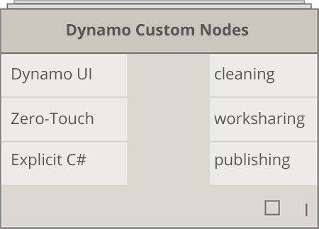
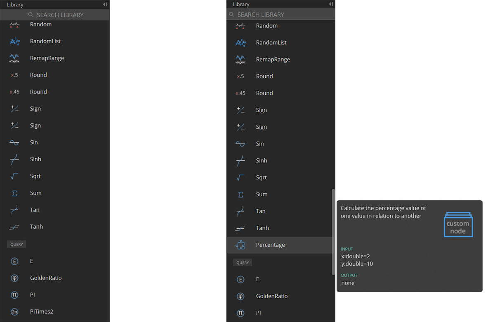

## 自訂節點

Dynamo 為廣泛的視覺程式設計任務提供許多核心節點。有時，更快、更有序或更輕鬆的共享解決方案是建置您自己的節點。這些節點可以在不同專案中重複使用，讓您的圖形更清楚整潔，可以推送至套件管理程式並可分享至全球 Dynamo 社群。

### 清理您的圖形

自訂節點的構成方式是在「Dynamo 自訂節點」中嵌套其他節點和自訂節點， 我們可以將「Dynamo 自訂節點」從概念上理解為容器。當在圖中執行此容器節點時，將執行其所有內部節點以允許您重複使用和共用一個有用的節點。

### 適應變更

當您在圖中有多個自訂節點副本時，您可以透過編輯基礎自訂節點來更新所有副本。這容許您透過採用工作流程或設計中可能發生的任何變更來順暢地更新您的圖形。

### 工作共用

雖然有爭議，但是一般認為自訂節點的最佳功能是其工作共用功能。如果「經驗豐富的使用者」建立了複雜的 Dynamo 圖形，並將其傳遞給不太熟悉 Dynamo 的新使用者，則他/她可壓縮圖形為最基本的內容以進行設計互動。可開啟自訂節點以編輯內部圖形，但「容器」可以保持簡單。使用此程序，自訂節點允許 Dynamo 使用者設計的簡潔、直觀的圖形。

### 有許多方式可建置節點

有多種方法可在 Dynamo 中建置自訂節點。在本章的範例中，我們將直接從 Dynamo 使用者介面建立自訂節點。如果您是程式設計人員且您對 C# 或「零接觸」格式感興趣，您可以參考 Dynamo Wiki 上的[此頁面 ](https://github.com/DynamoDS/Dynamo/wiki/How-To-Create-Your-Own-Nodes)以更深入的瞭解。

### 自訂節點環境

讓我們跳至自訂節點環境，並建立一個簡單的節點來計算百分比。自訂節點環境不同於 Dynamo 圖形環境，但其互動根本相同。在此基礎上，讓我們建立第一個自訂節點！

> 若要從頭開始建立自訂節點，啟動 Dynamo，然後選取「自訂節點」，或在畫布上按住 Ctrl + Shift + N。

> 在「自訂節點內容」對話框中指定名稱、說明和類別。

> 1. **名稱：**百分比
2. **說明**：計算一個值相對於另一個值的百分比。
3. **類別：** Core.Math

> 這將開啟一個具有黃色背景的畫布，表示您正在自訂節點內工作。在此畫布上，您可以存取所有核心 Dynamo 節點，以及 **Input** 和 **Output** 節點，其標示資料流進和流出自訂節點。 它們可以在 *Core > Input* 下找到。

> 1. **Input：**輸入節點用於在自訂節點上建立輸入埠。 輸入節點的語法為 *input_name : datatype = default_value（可選）*。

2. **Output ：**類似於輸入，將在自訂節點上建立和命名輸出埠。 考慮向輸入埠和輸出埠新增 **Custom Comment**，以提示輸入和輸出類型。 這會更加詳細地在 [「建立自訂節點」部分](9-2_Creating.md)進行討論。

您可以將此自訂節點儲存為 .dyf（而非標準 .dyn）檔案，它將會自動新增至您的階段作業和將來的階段作業中。您將在資源庫中自訂節點內容指定的類別下找到自訂節點。

> 左側：預設資源庫的「Core」>「Math 」類別 右側：新自訂節點的「Core」>「Math 」類別

### 向前移動

現在，我們建立了第一個自訂節點，下一部分將深入瞭解自訂節點功能以及如何發佈一般工作流程。在以下部分中，我們將瞭解如何開發可將幾何圖形從一個平面轉移至另一個平面的自訂節點。

