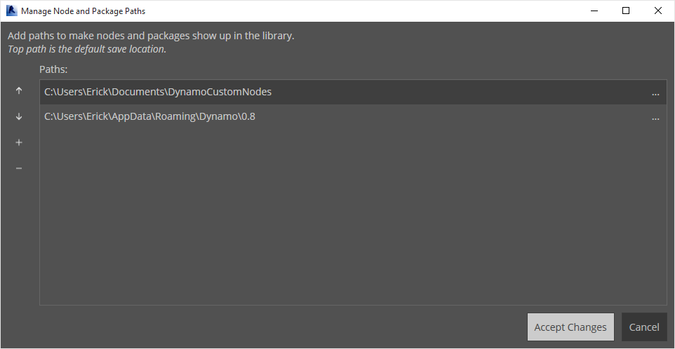
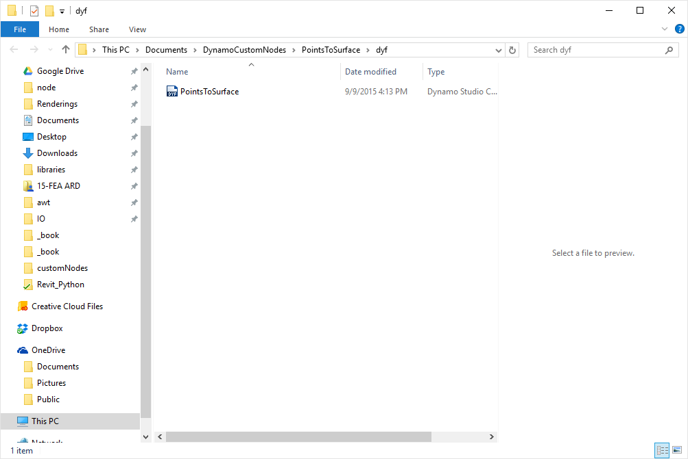

## 新增至您的資源庫

我們剛剛建立了自訂節點並將其套用至 Dynamo 圖形中的特定程序。我們非常喜歡此節點，因此，我們要將其保留在我們的 Dynamo 資源庫以在其他圖形中進行參考。若要執行此作業，我們將在本端發佈此節點。此程序與發佈套件的程序類似，我們將在下一個章節中進行詳細討論。

### 在本端發佈自訂節點

讓我們繼續瞭解在前一個部份中建立的自訂節點。透過在本端發佈節點，當您開啟一個新的階段作業時該節點將可在 Dynamo 資源庫中存取。如果不發佈節點，參照自訂節點的 Dynamo 圖形也必須在其資料夾中具有該自訂節點（或必須使用 *「檔案」>「匯入資源庫」將自訂節點匯入至 Dynamo 中*)。

> 下載此練習隨附的範例檔案 (按一下右鍵，然後按一下「鏈結另存為...」)。附錄中提供範例檔案的完整清單。[PointsToSurface.dyf](datasets/9-3/PointsToSurface.dyf)

> 開啟 PointsToSurface 自訂節點後，我們會在「Dynamo 自訂節點」編輯器中看到上圖。您也可以透過在「Dynamo 圖形編輯器」中按兩下自訂節點來開啟該自訂節點。

> 1. 若要在本端發佈自訂節點，只需在畫布上按一下右鍵，然後選取*「發佈此自訂節點...」*

> 參照上圖填寫相關資訊，並選取*「在本端發佈」*。請注意，「群組」欄位定義可從 Dynamo 功能表存取的主要元素。

> 選取資料夾，以容納所有計劃在本端發佈的自訂節點。Dynamo 會在每次載入時檢查此資料夾，以便確認該資料夾位於固定位置。導覽至此資料夾，然後選擇 *「選取資料夾」。*Dynamo 節點現已在本端發佈，並將在每次載入程式時保留在 Dynamo 工具列中！

> 1. 要檢查自訂節點的資料夾位置，請跳至*「設定」>「管理節點和套件路徑...」*

> 在此視窗中，我們可看到兩個路徑：*AppData\Roaming\Dynamo ...*，表示線上安裝之 Dynamo 套件的預設位置。 *Documents\DynamoCustomNodes ...*，表示本端發佈之自訂節點的位置。 *

> 1. 您可能想要將本端資料夾路徑在上方清單順序中下移 （透過選取資料夾路徑並按一下路徑名稱左側的向下箭頭）。頂層資料夾是套件安裝的預設路徑。因此，透過將預設 Dynamo 套件安裝路徑保留為預設資料夾，線上套件將與本端發佈的節點分離。*

> 我們已切換路徑名稱的順序，以將 Dynamo 的預設路徑作為套件的安裝位置。

> 導覽至此本端資料夾，我們可以在*「.dyf 」*資料夾中找到原始自訂節點，.dyf 是 Dynamo 自訂節點檔案的副檔名。 我們可以編輯此資料夾中的檔案，節點將在使用者介面中更新。我們還可以新增更多節點至主 *DynamoCustomNode* 資料夾，Dynamo 會在重新啟動時將其新增到您的資源庫！

> Dynamo 現在每次會使用 Dynamo 資源庫*「DynamoPrimer」*組中的 *「PointsToSurface 」*進行載入。

