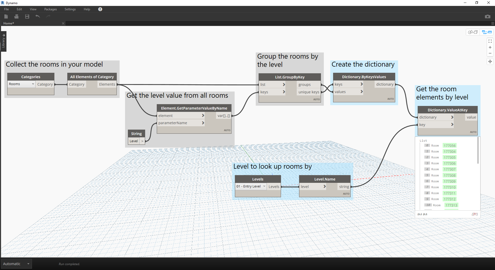

# 字典 - Revit 使用情況

您是否曾想要依據當中包含的資料片段查看 Revit 中的一些內容？

#### 如果您完成了類似下列作業，就可能達到這個目的：


> 在上面的影像中，我們收集 Revit 模型中的所有房間、取得所需房間的索引 (依房間號碼)，最後取得索引處的房間。

### 現在讓我們使用字典重新創造這個構想。

> 下載此練習隨附的範例檔案 (按一下右鍵，然後按一下「另存連結為...」)：[RoomDictionary.dyn](datasets/9-4_roomDictionary.dyn)。附錄中提供範例檔案的完整清單。

 首先我們必須收集 Revit 模型中的所有房間。

> * 我們選擇我們想要使用的 Revit 品類 (在本案例中，我們使用房間)。
* 我們告訴 Dynamo 收集所有這些元素

 接著，我們必須決定要使用哪些鍵來查詢此資料。(在 [9-1 什麼是字典？](9-1_What-is-a-dictionary,md)一節可以找到鍵的相關資訊)。

> * 我們要使用的資料是房間號碼。

 現在，我們要使用給定的鍵和元素建立字典。

> * ```Dictionary.ByKeysValues``` 節點會在給定適當輸入的狀況下建立字典。
* ```Keys``` 必須是字串，而 ```values``` 可以是各種物件類型。

 最後，我們現在可以從字典中使用房間號碼擷取房間。

> * ```Strings``` 是我們要用來從字典中查詢物件的鍵。
* ```Dictionary.ValueAtKey``` 現在會從字典中取得物件。

---

### 使用同樣的字典邏輯，我們也可以使用群組的物件建立字典。如果我們想要查詢給定樓層的所有房間，可以修改上面的圖表，如下所示。


> * 我們現在不使用房間號碼做為鍵，而是使用參數值 (在此案例中，我們將使用樓層)。


> * 現在，我們可以依據房間所在的樓層將房間分組。


> * 有了依樓層分組的元素，我們現在可以使用共用鍵 (唯一鍵) 做為字典的鍵，使用房間的清單做為元素。



> * 最後，使用 Revit 模型中的樓層，我們可以在字典中查詢哪些房間位於該樓層。```Dictionary.ValueAtKey``` 會取得樓層名稱，然後傳回該樓層的房間物件。

使用字典的時機非常多。將 Revit 中的 BIM 資料與元素本身建立關係，就可以產生各種使用情況。

