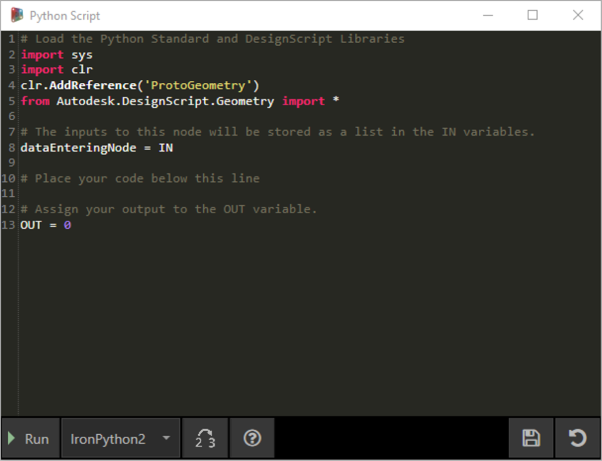
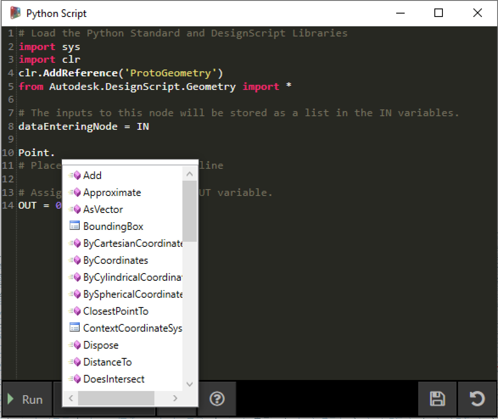
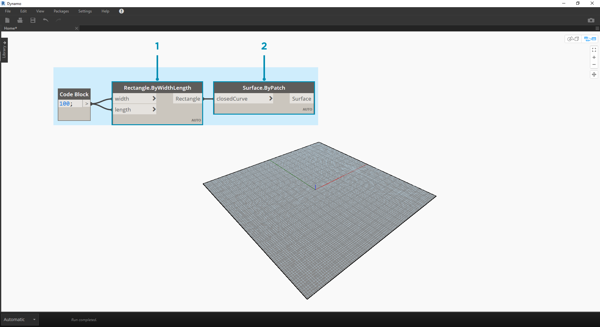
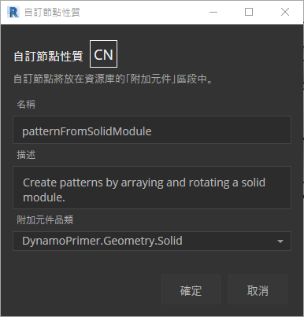

## Python

Python 是使用廣泛的程式設計語言，其備受青睞與其語法樣式有很大關係。Python 的可讀性很高，因此較許多其他語言更容易瞭解。Python 支援模組與套件，可嵌入至既有應用程式中。本節中的範例假定您對 Python 有基本瞭解。若要取得有關如何正常使用 Python 的資訊，[Python.org](https://www.python.org/) 上的[「入門」](https://www.python.org/about/gettingstarted/)頁面是良好的資源。

### 視覺程式設計與文字程式設計的對比

為什麼要在 Dynamo 的視覺程式設計環境中使用文字程式設計？我們在第 1.1 章討論過，視覺程式設計有許多優勢。您可藉此在直觀視覺介面中建立程式時，不必學習特殊語法。但是，視覺程式可能會變得雜亂，有時會缺少功能。例如，Python 會提供可實現程度高得多的方法，以編寫條件陳述式 (if/then) 及迴圈。Python 是功能強大的工具，可以延伸 Dynamo 的功能，您可藉此使用幾行簡潔的程式碼來取代許多節點。

**視覺程式：**

**文字程式：**

```
import clr
clr.AddReference('ProtoGeometry')
from Autodesk.DesignScript.Geometry import *

solid = IN[0]
seed = IN[1]
xCount = IN[2]
yCount = IN[3]

solids = []

yDist = solid.BoundingBox.MaxPoint.Y-solid.BoundingBox.MinPoint.Y
xDist = solid.BoundingBox.MaxPoint.X-solid.BoundingBox.MinPoint.X

for i in xRange:
for j in yRange:
fromCoord = solid.ContextCoordinateSystem
toCoord = fromCoord.Rotate(solid.ContextCoordinateSystem.Origin,Vector.ByCoordinates(0,0,1),(90*(i+j%val)))
vec = Vector.ByCoordinates((xDist*i),(yDist*j),0)
toCoord = toCoord.Translate(vec)
solids.append(solid.Transform(fromCoord,toCoord))

OUT = solids
```

### Python 節點

與程式碼塊類似，Python 節點是視覺程式設計環境中的腳本介面。Python 節點位於資源庫中的*「Core」>「Scripting」*下。按兩下節點將開啟 python 腳本編輯器 (您也可以在節點上按一下右鍵，然後選取*「編輯...」*)。



> 您會注意到頂部有一些重複使用文字，其目的是協助您參考將需要的資源庫。輸入儲存於 IN 陣列中。透過為 OUT 變數指定值，會將這些值傳回至 Dynamo。

藉由 Autodesk.DesignScript.Geometry 資源庫，您可以使用與程式碼塊類似的圓點符號。若要取得有關 Dynamo 語法的更多資訊，請參閱第 7.2 章以及 [DesignScript 指南](http://dynamobim.org/wp-content/links/DesignScriptGuide.pdf)。鍵入幾何圖形類型，例如「Point.」。將顯示建立及查詢點的方法清單。



> 這些方法包括建構函式 (例如 *ByCoordinates*)、動作 (例如 *Add*) 以及查詢 (例如 *X*、*Y* 與 *Z* 座標)。

### 練習

> 下載此練習隨附的範例檔案 (按一下右鍵，然後按一下「連結另存為...」)。附錄中提供範例檔案的完整清單。[Python_Custom-Node.dyn](datasets/10-4/Python-CustomNode.dyn)

在此範例中，我們將編寫從實體模組建立樣式的 python 腳本，然後將其轉換為自訂節點。首先，使用 Dynamo 節點建立實體模組。



> 1. **Rectangle.ByWidthLength：**建立將做為實體基準的矩形。
2. **Surface.ByPatch：**將矩形連接至「*closedCurve*」輸入以建立底部曲面。


> 1. **Geometry.Translate：**將矩形連接至「*geometry*」輸入以將其上移，使用程式碼塊指定實體的基準厚度。
2. **Polygon.Points：**查詢平移的矩形以萃取角點。
3. **Geometry.Translate：**使用程式碼塊建立包含四個值 (對應於四個點) 的清單，同時將實體的一個角點上移。
4. **Polygon.ByPoints：**使用平移的點重新建構頂部多邊形。
5. **Surface.ByPatch：**連接多邊形以建立頂部曲面。

現在我們已建立頂部與底部曲面，接下來在兩個縱斷面之間進行斷面混成，以建立實體的側面。


> 1. **List.Create：**將底部矩形與頂部多邊形連接至索引輸入。
2. **Surface.ByLoft：**對兩個縱斷面進行斷面混成，以建立實體的側面。
3. **List.Create：**將頂部、側面與底部的曲面連接至索引輸入，以建立曲面清單。
4. **Solid.ByJoinedSurfaces：**接合曲面以建立實體模組。

現在我們已建立實體，接下來將 Python Script節點放至工作區。


> 若要加入其他輸入至節點，請關閉編輯器，然後按一下節點上的「+」圖示。輸入命名為 IN[0]、IN[1] 等以指示其代表清單中的項目。

我們從定義輸入與輸出開始。按兩下節點以開啟 python 編輯器。


```
# Enable Python support and load DesignScript library
import clr
clr.AddReference('ProtoGeometry')
from Autodesk.DesignScript.Geometry import *

# The inputs to this node will be stored as a list in the IN variables.
#The solid module to be arrayed
solid = IN[0]
#A number that determines which rotation pattern to use
seed = IN[1]
#The number of solids to array in the X and Y axes
xCount = IN[2]
yCount = IN[3]

#Create an empty list for the arrayed solids
solids = []

# Place your code below this line

# Assign your output to the OUT variable.
OUT = solids
```

在我們進行練習時，此程式碼會更容易理解。接下來，我們需要考慮需要哪些資訊以排列實體模組。首先，我們需要知道實體的標註，以確定平移距離。由於存在邊界框錯誤，我們不得不使用邊曲線幾何圖形來建立邊界框。


> 看一下 Dynamo 中的 Python 節點。請注意，我們使用的語法與 Dynamo 節點標題中的語法相同。註釋的程式碼如下。

```
# Enable Python support and load DesignScript library
import clr
clr.AddReference('ProtoGeometry')
from Autodesk.DesignScript.Geometry import *

# The inputs to this node will be stored as a list in the IN variables.
#The solid module to be arrayed
solid = IN[0]
#A number that determines which rotation pattern to use
seed = IN[1]
#The number of solids to array in the X and Y axes
xCount = IN[2]
yCount = IN[3]

#Create an empty list for the arrayed solids
solids = []
# Create an empty list for the edge curves
crvs = []

# Place your code below this line
#Loop through edges and append corresponding curve geometry to the list
for edge in solid.Edges:
crvs.append(edge.CurveGeometry)
#Get the bounding box of the curves
bbox = BoundingBox.ByGeometry(crvs)

#Get the X and Y translation distance based on the bounding box
yDist = bbox.MaxPoint.Y-bbox.MinPoint.Y
xDist = bbox.MaxPoint.X-bbox.MinPoint.X

# Assign your output to the OUT variable.
OUT = solids
```

由於我們將平移並旋轉實體模組，因此接下來使用 Geometry.Transform 作業。看一下 Geometry.Transform 節點，我們知道需要來源座標系統與目標座標系統，以平移實體。來源是實體的關聯座標系統，而目標是所排列每個模組的不同座標系統。這意味著我們必須循環使用 x 值與 y 值，以便每次以不同方式平移座標系統。


> 看一下 Dynamo 中的 Python 節點。註釋的程式碼如下。

```
# Enable Python support and load DesignScript library
import clr
clr.AddReference('ProtoGeometry')
from Autodesk.DesignScript.Geometry import *

# The inputs to this node will be stored as a list in the IN variables.
#The solid module to be arrayed
solid = IN[0]
#A number that determines which rotation pattern to use
seed = IN[1]
#The number of solids to array in the X and Y axes
xCount = IN[2]
yCount = IN[3]

#Create an empty list for the arrayed solids
solids = []
# Create an empty list for the edge curves
crvs = []

# Place your code below this line
#Loop through edges and append corresponding curve geometry to the list
for edge in solid.Edges:
crvs.append(edge.CurveGeometry)
#Get the bounding box of the curves
bbox = BoundingBox.ByGeometry(crvs)

#Get the X and Y translation distance based on the bounding box
yDist = bbox.MaxPoint.Y-bbox.MinPoint.Y
xDist = bbox.MaxPoint.X-bbox.MinPoint.X
#get the source coordinate system
fromCoord = solid.ContextCoordinateSystem

#Loop through X and Y
for i in range(xCount):
for j in range(yCount):
#Rotate and translate the coordinate system
toCoord = fromCoord.Rotate(solid.ContextCoordinateSystem.Origin,Vector.ByCoordinates(0,0,1),(90*(i+j%seed)))
vec = Vector.ByCoordinates((xDist*i),(yDist*j),0)
toCoord = toCoord.Translate(vec)
#Transform the solid from the source coord system to the target coord system and append to the list
solids.append(solid.Transform(fromCoord,toCoord))

# Assign your output to the OUT variable.
OUT = solids
```


> 在 Python 節點上按一下「執行」，可以執行程式碼。


> 請嘗試變更種子值以建立不同的樣式。您也可以變更實體模組本身的參數，以取得不同的效果。在 Dynamo 2.0 中，您可以直接變更種子並按一下「執行」，不用關閉 Python 視窗。

現在我們已建立有用的 python 腳本，接下來將其另存成自訂節點。選取 Python Script 節點，按一下右鍵，然後選取「從選項新增節點」。



> 指定名稱、描述與品類。

這將開啟新工作區，從中將編輯自訂節點。


> 1. **Input：**變更輸入名稱以更具描述性，然後加入資料類型及預設值。
2. **Output：**變更輸出名稱，將節點另存成 .dyf 檔案。


> 自訂節點將反映我們剛剛進行的變更。

