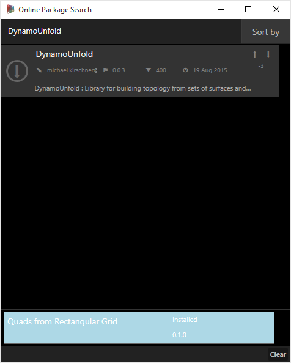
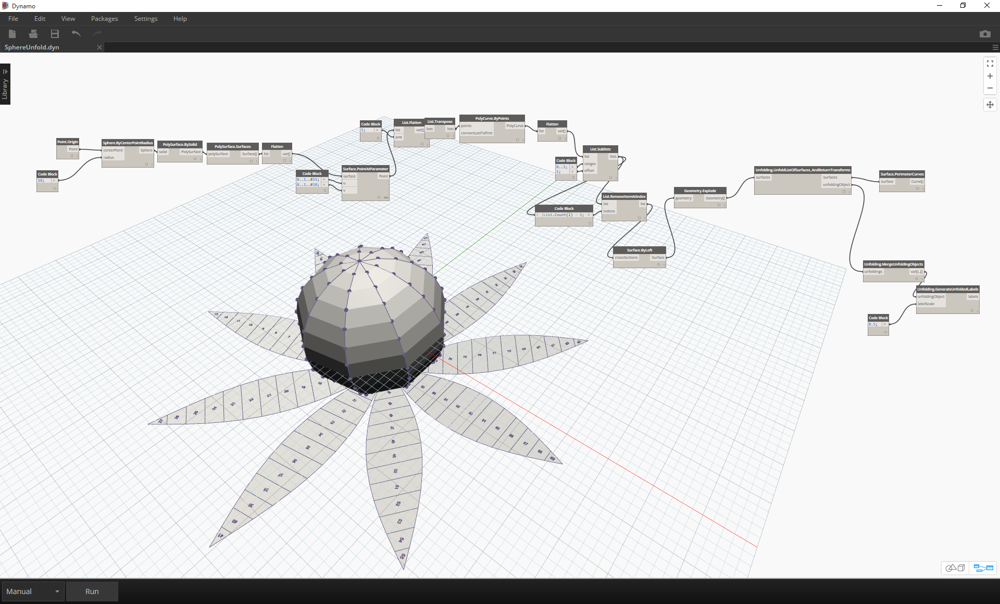

## 套件

簡言之，套件是自訂節點的集合。Dynamo Package Manager 是供社群對已經線上發佈的套件進行下載的入口網站。這些工具集由協力廠商為了延伸 Dynamo 的核心功能而開發，任何人都能存取，按一下按鈕即可隨時下載。

開放原始碼專案 (例如 Dynamo) 在此類型的社群參與下蓬勃發展。使用專屬的協力廠商開發人員，Dynamo 可以將其適用範圍延伸到一系列產業的工作流程中。因此，Dynamo 團隊齊心協力簡化套件的開發與發佈 (在後續各節中將更詳細地討論這一點)。

### 安裝套件

最簡易的套件安裝方式是使用 Dynamo 介面中的套件工具列。現在我們使用該工具列並安裝一個套件。在此簡單範例中，我們將安裝某常見套件，以便在格線上建立四邊形面板。

> 1. 在 Dynamo 中，移至*「套件」>「搜尋套件...」*

> 在搜尋列中，我們搜尋「quads from rectangular grid」。片刻之後，您應該會看到符合此搜尋查詢的所有套件。我們要選取具有相符名稱的第一個套件。

> 1. 按一下套件名稱左側的下載箭頭，套件將進行安裝。完成！

> 1. 請注意，Dynamo 資源庫中現在存在另一個群組，稱為*「buildz」*。此名稱是指套件的[開發人員](http://buildz.blogspot.com/)，此群組中已放置自訂節點。我們可以立即開始使用此群組。

> 使用快速代碼區塊作業定義矩形格線，我們已建立矩形面板的清單。

### 套件資料夾

上述範例著重針對具有一個自訂節點的套件，不過您可以使用相同程序下載具有多個自訂節點的套件並支援資料檔案。現在使用更全面的套件 (Dynamo Unfold) 演示這一點。

> 在上述範例中，首先選取*「套件」>「搜尋套件...」*。這一次我們將搜尋*「DynamoUnfold」*，這是一個單字，請注意大寫。看到套件時，按一下套件名稱左側的箭頭進行下載。現在將在您的 Dynamo 資源庫中安裝 Dynamo Unfold。

> 在 Dynamo 資源庫中，我們的 *DynamoUnfold* 群組具有多個品類和自訂節點。

> 現在，我們看一下套件的檔案結構。在 Dynamo 中，選取*「套件」>「管理套件...」*。我們將看到上述視窗，其中包含我們已安裝的兩個資源庫。按一下 *DynamoUnfold* 右側的按鈕，然後選取*「展示根目錄」。*

> 此作業會將我們移至套件的根目錄。請注意，我們有 3 個資料夾與一個檔案。

> 1. *bin* 資料夾包含 .dll 檔案。此 Dynamo 套件使用 Zero-Touch 進行開發，因此自訂節點保留在此資料夾中。
2. *dyf* 資料夾包含自訂節點。此套件未使用 Dynamo 自訂節點進行開發，所以此資料夾不包含此套件的內容。
3. extra 資料夾包含所有其他檔案 (包括範例檔案)。
4. pkg 檔案是定義套件設定的基本文字檔案。現在我們可以忽略該檔案。

> 開啟*「extra」*資料夾，我們可以看到隨安裝而下載的一系列範例檔案。並非所有套件都有範例檔案，但此若套件有範例檔案，您可以在此處找到這些檔案。接下來開啟*「SphereUnfold」*。

> 開啟檔案並按一下解析器上的*「執行」*後，即可展開圓球！諸如此類的範例檔案有助於學習如何使用新 Dynamo 套件。

### Dynamo Package Manager

探索 Dynamo 套件的另一種方式是線上探究 [Dynamo Package Manager](http://dynamopackages.com/)。這是瀏覽套件的良好方式，因為儲存庫會根據下載計數與受歡迎程度的順序對套件排序。此外，使用該方式可以輕鬆收集套件最近更新的相關資訊，因為某些 Dynamo 套件受 Dynamo 版次的版本與相依性限制。

> 在 Dynamo Package Manager 中按一下*「Quads from Rectangular Grid」*，您可以查看其描述、版本、開發人員及可能的相依性。

您也可以從 Dynamo Package Manager 下載套件檔案，但是從 Dynamo 直接執行此作業會更順暢。

### 檔案儲存於本端的什麼位置？

若您從 Dynamo package manager 下載檔案，或希望查看所有套件檔案的儲存位置，請按一下*「設定」>「管理節點和套件路徑...」*。按一下資料夾目錄旁的省略號，您可以複製根資料夾，並在檔案總管視窗中探究套件。依預設，會將套件安裝在與以下資料夾路徑類似的位置：*C:/Users/[使用者名稱]/AppData/Roaming/Dynamo/[Dynamo 版本]*。

### 進一步使用套件

Dynamo 社群在不斷成長與發展。透過不時地探索 Dynamo Package Manager，您會發現一些激動人心的新開發功能。在以下各節，我們將從終端使用者的視角到建立您自己的 Dynamo 套件，更深入地查看套件。

