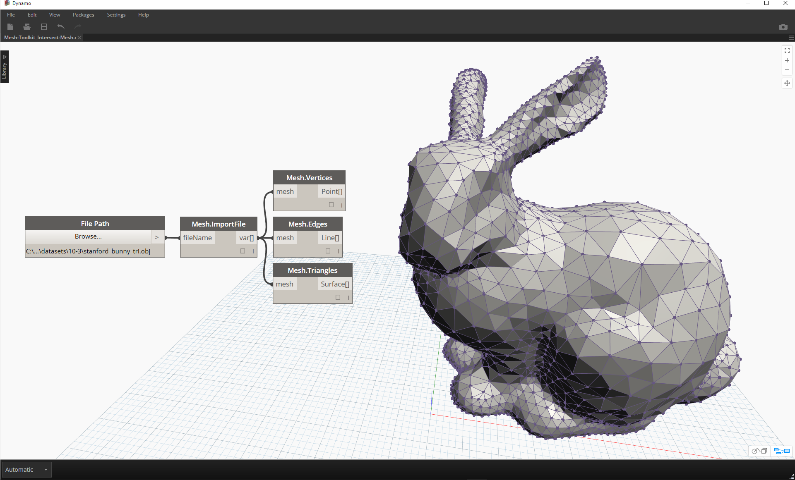
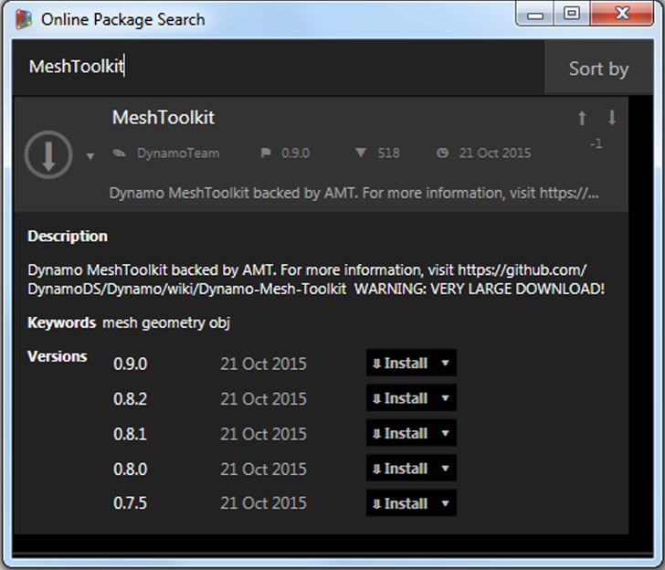
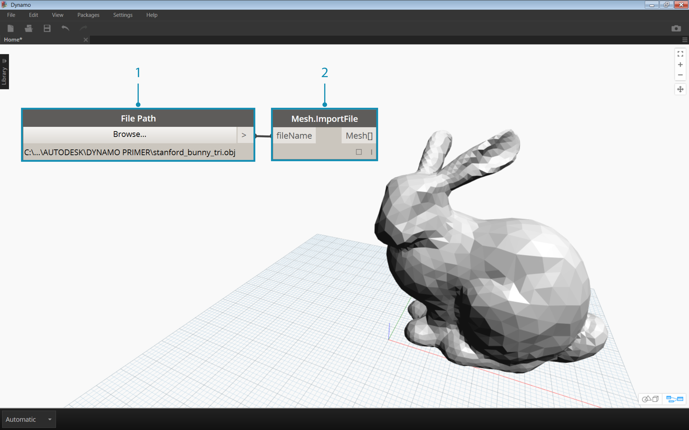
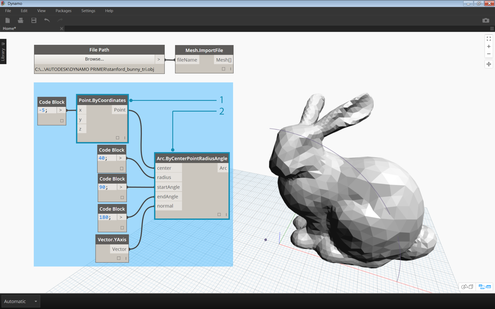
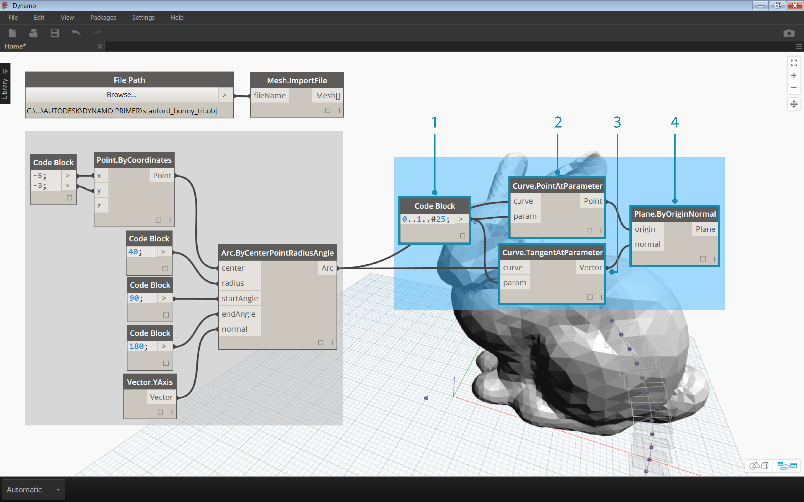
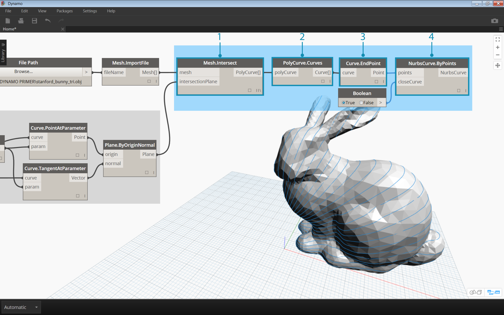
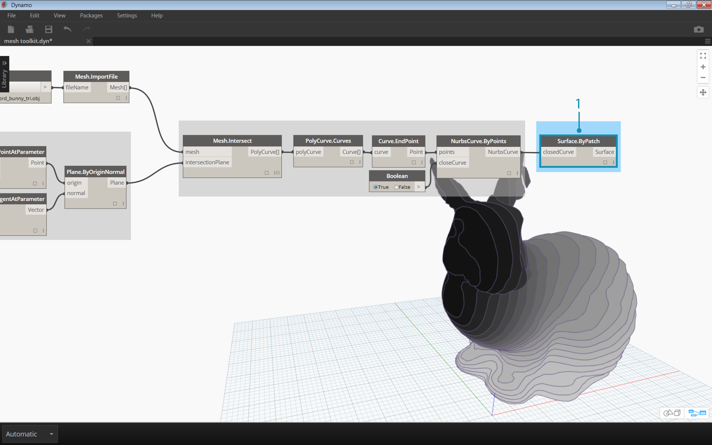

## 套件案例研究 – 網面工具箱

Dynamo 網面工具箱可提供工具，以匯入外部檔案格式的網面、根據 Dynamo 幾何圖形物件建立網面，並根據網面的頂點與索引手動建置網面。該資源庫還提供工具來修改網面、修復網面，或萃取水平切片，以用於加工。

Dynamo 網面工具箱是 Autodesk 的持續網面研究的一部分，因此在未來的幾年將繼續成長。該工具箱將頻繁推出新方法，請隨時與 Dynamo 團隊聯繫以提供註解、錯誤以及新功能的建議。

### 網面與實體

下面的練習演示了使用網面工具箱可執行的一些基本網面作業。在此練習中，我們將網面與一系列的平面相交，如果使用實體執行此作業，則運算成本很高。與實體不同，網面具有一組「解析度」， 並不以數學方式定義，而是以拓樸方式定義，我們可根據要執行的作業來定義此解析度。有關網面與實體關係的詳細資訊，您可以參考此手冊的[計算設計的幾何圖形](../05_Geometry-for-Computational-Design/5_geometry-for-computational-design.md)一章。 有關網面工具箱的更詳細資訊，您可以參考 [Dynamo Wiki 頁面。](https://github.com/DynamoDS/Dynamo/wiki/Dynamo-Mesh-Toolkit)讓我們跳至下面的練習部分。

### 安裝網面工具箱

> 在 Dynamo 中，請跳至頂部功能表列的*組件 > 搜尋套件 ...*。 在「搜尋」欄位中，鍵入 *" MeshToolkit "*（一個單詞，區分大小寫）。 按一下「下載」箭頭以下載適用於您的 Dynamo 版本的套件。就是這麼簡單！

### 練習

> 下載並解壓縮此練習的範例檔案 (按一下右鍵，然後按一下「鏈結另存為...」)。附錄中提供範例檔案的完整清單。[MeshToolkit.zip](datasets/10-2/MeshToolkit.zip)

首先，開啟 Dynamo 中的 *Mesh-Toolkit_Intersect-Mesh.dyn。*在此範例中，我們將瞭解網面工具箱的「相交」節點。 我們將匯入網面並將其與一系列輸入平面相交以建立切面。這是準備模型以使用鐳射切割、水刀切割或數控機床進行加工的起點。

> 1. **File Path：**尋找網面檔案以匯入 (*stanford_bunny_tri.obj*)。 支援的檔案類型為 .mix 和 .obj
2. **Mesh.ImportFile：**連接檔案路徑以匯入網面

> 1. **Point.ByCoordinates：**建構一個點 – 這將是弧的中心。
2. **Arc.ByCenterPointRadiusAngle：**在點週圍建構弧。 此曲線將用於定位一系列的平面。

> 1. Code Block：建立介於 0 和 1 的一系列數字。
2. **Curve.PointAtParameter：**將弧連接到*「曲線」*輸入並將程式碼區塊輸出連接至 *「參數」*輸入以萃取一系列曲線上的點。
3. **Curve.TangentAtParameter：**作為前一個節點連接相同輸入。
4. **Plane.ByOriginNormal：**將點連接至*「原始」*輸入並將向量連接至 *「一般 」* 輸入建立由每個點組成的一系列平面。

現在，您應該可看到一系列沿著弧的平面。接下來，我們將使用這些平面來與網面相交。

> 1. **Mesh.Intersect：**將匯入的網面與多個平面相交，建立一系列的 PolyCurve 等高線。
2. **PolyCurve.Curves：**將 PolyCurve 截斷為其曲線部分。
3. **Curve.EndPoint：**萃取每條曲線的端點。
4. **NurbsCurve.ByPoints：**使用點來建構 NURBS 曲線。 將布林運算節點設定為*「True 」*，以關閉曲線。

> 1. **Surface.ByPatch：**為每條等高線建構表面填充，以便建立網面的「切面」。

> 新增第二組切面，以實現格子/條板箱效果。

您可能會發現與立體相比，網面相交作業計算速度更快。諸如本練習中演示的工作流程可完美用於網面。

