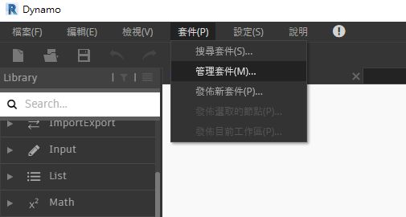
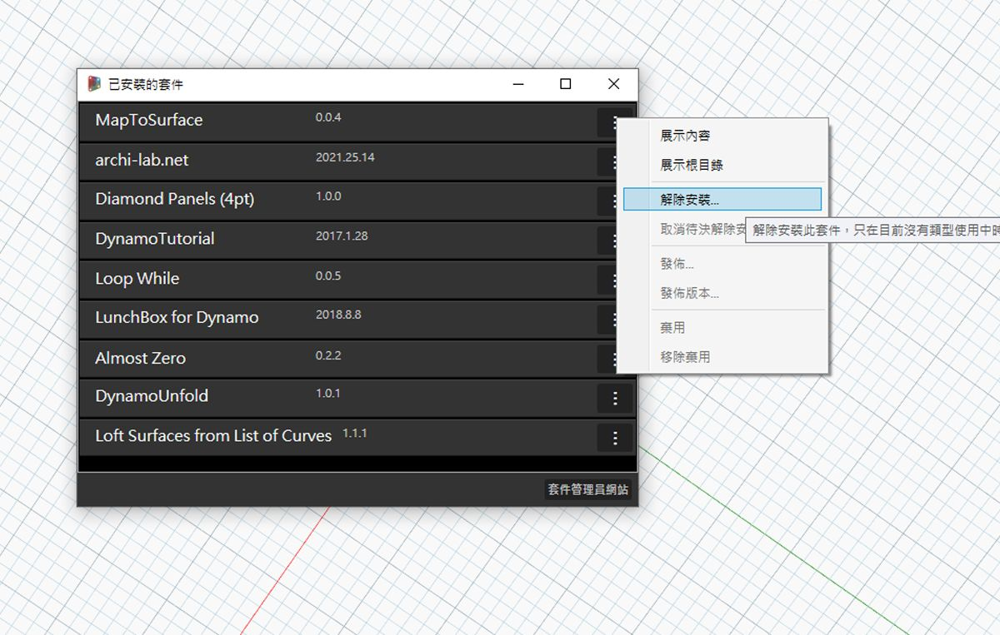
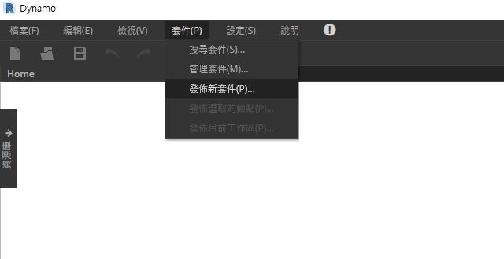
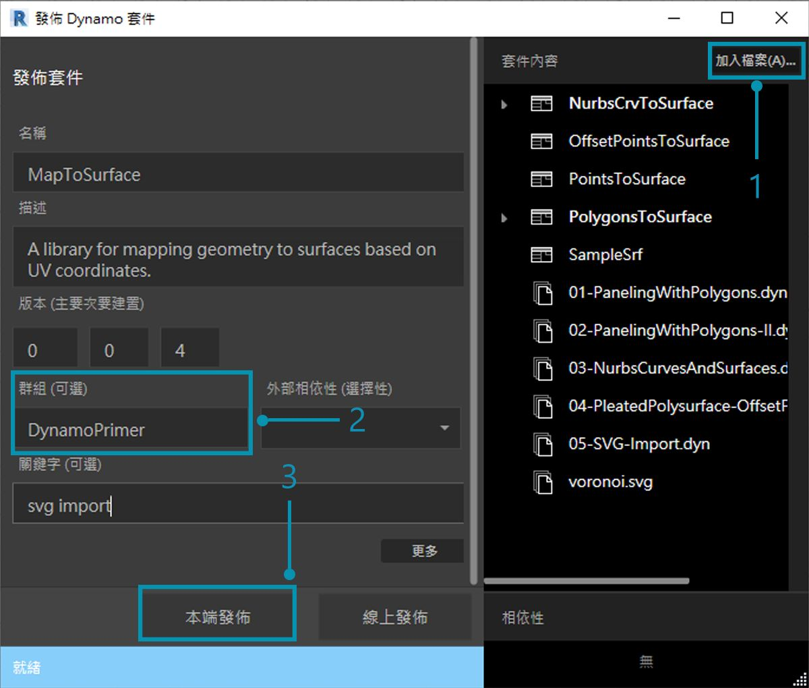
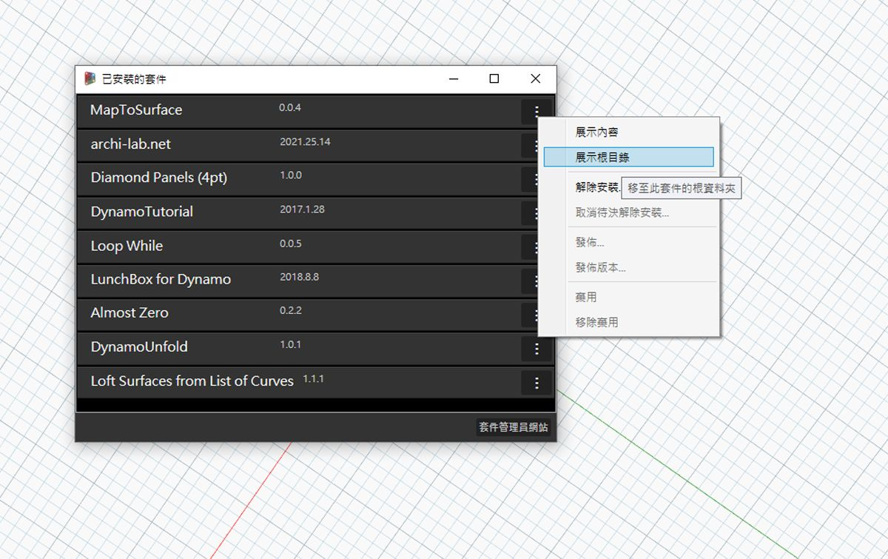
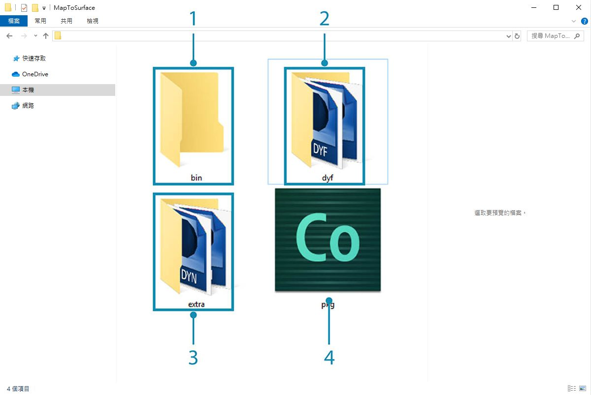
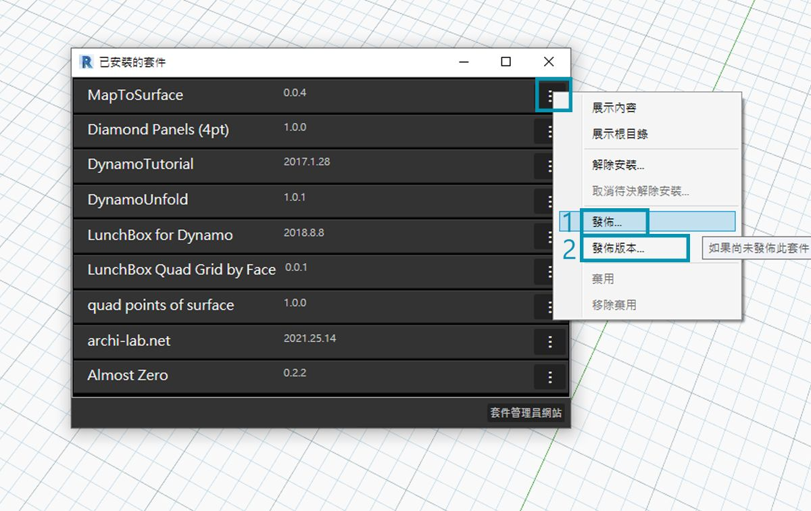

## 發佈套件

在先前各節中，我們詳細瞭解了如何使用自訂節點與範例檔案設置 *MapToSurface* 套件。  但是，如何發佈已在本端開發的套件呢？  此案例研究將演示如何發佈本端資料夾中一組檔案內的套件。

有多種方法可發佈套件。以下是建議的程序：**本端發佈、本端開發，然後線上發佈**。我們從包含套件中所有檔案的資料夾開始。

### 解除安裝套件
在對發佈 MapToSurface 套件進行瞭解之前，若您已在上一課程中安裝該套件，請將其解除安裝，以便不會使用相同的套件。

> 開始先移至*「套件」>「管理套件...」*

> 選取對應於*「MapToSurface」*的按鈕，然後選取*「解除安裝...」*。然後重新啟動 Dynamo。重新開啟後，若檢查*「管理套件」*視窗，會發現其中應該不再包含 *MapToSurface*。現在我們已準備好重新開始！

### 本端發佈套件

*注意事項：自寫下此資訊之時起，只能在 Dynamo for Revit 和 Dynamo for Civil 3d 中啟用 Dynamo 套件發佈。Dynamo Sandbox 沒有發佈功能。*

> 下載並解壓縮此套件案例研究隨附的範例檔案 (按一下右鍵，然後按一下「連結另存為...」)。附錄中提供範例檔案的完整清單。[MapToSurface.zip](datasets/11-4/MapToSurface.zip)

> 這是為套件首次提交的檔案，我們已將所有範例檔案與自訂節點置於一個資料夾中。  準備好此資料夾後，我們已準備好上載至 Dynamo Package Manager。
1. 此資料夾包含五個自訂節點 (.dyf)。
2. 此資料夾還包含五個範例檔案 (.dyn) 與一個匯入的向量檔案 (.svg)。這些檔案將作為介紹練習，用以向使用者展示如何使用自訂節點。

> 在 Dynamo 中，先按一下*「套件」>「發佈新套件...」*

> 在*「發佈 Dynamo 套件」*視窗中，我們已填寫視窗左側的相關表單。
1. 透過按一下*「加入檔案」*，我們還在畫面右側加入了資料夾結構中的檔案 (若要加入不是 .dyf 的檔案，請確保在瀏覽器視窗中將檔案類型變更為**「所有檔案」**)"**. 請注意，我們已經不加選擇地加入每個檔案，即自訂節點檔案 (.dyf) 或範例檔案 (.dyn)。我們發佈該套件時，Dynamo 將對這些項目進行分類。
2. 「群組」欄位會定義在 Dynamo 使用者介面中要尋找自訂節點的群組。
3. 按一下「本端發佈」以發佈。若您要繼續作業，請確保按一下*「本端發佈」*，**而不是***「線上發佈」*，我們不希望 Package Manager 上存在一系列重複套件。

> 1. 發佈後，在「DynamoPrimer」群組或 Dynamo 資源庫下應該會顯示自訂節點。

> 現在，我們看一下根目錄，以瞭解 Dynamo 如何格式化我們剛剛建立的套件。按一下*「套件」>「管理套件...」*以執行此作業

> 在「管理套件」視窗中，按一下*「MapToSurface」*右側的三個垂直點，然後選擇*「展示根目錄」。*

> 請注意，根目錄位於套件的本端位置 (請記住，我們曾「本端」發佈套件)。  Dynamo 目前參考此資料夾以讀取自訂節點。因此，您務必將目錄本端發佈至永久資料夾位置 (即不是您的桌面)。以下將分解講述 Dynamo 套件資料夾：
1. *bin* 資料夾包含使用 C# 或 Zero-Touch 資源庫建立的 .dll 檔案。  我們沒有為此套件建立任何內容，所以此範例的此資料夾為空白。
2. *dyf* 資料夾包含自訂節點。  開啟此資料夾將顯示此套件的所有自訂節點 (.dyf 檔案)。
3. extra 資料夾包含所有其他檔案。  這些檔案可能是 Dynamo 檔案 (.dyn)，也可能是所需的任何其他檔案 (.svg、.xls、.jpeg、.sat 等)。
4. pkg 檔案是定義套件設定的基本文字檔案。它是 Dynamo 中自動建立的檔案，但是如果您希望取得詳細資料，可以編輯該檔案。

### 線上發佈套件

> **注意事項：除非您將實際發佈自己的套件，否則請勿繼續執行此步驟！**
1. 準備好發佈後，在「管理套件」視窗中，選取 MapToSurface 右側的按鈕，然後選擇*「發佈...」*
2. 如果您要更新已發佈的套件，請選擇「發佈版本」，Dynamo 將根據該套件根目錄中的新檔案，線上更新您的套件。非常簡單！

### 發佈版本...
若要更新已發佈套件根資料夾中的檔案，您可以在*「管理套件」*視窗中選取*「發佈版本...」*，以發佈新版本的套件。  透過此順暢方式，可以對內容進行必要更新以及與社群分享。  只有在您是套件的維護者時，才能使用*「發佈版本」*。
