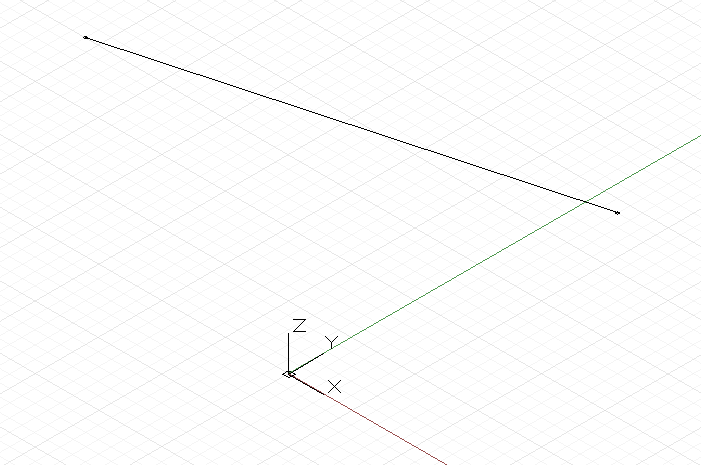
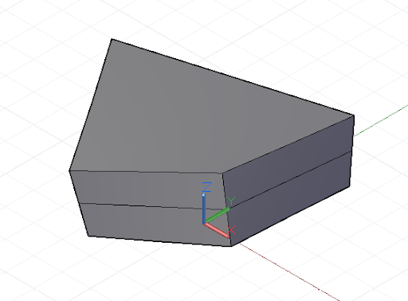

# DesignScript 幾何圖形基礎知識

Dynamo 標準幾何圖形資源庫中最簡單的幾何圖形物件是一個點。所有幾何圖形都是使用稱作建構函式的特殊函數建立的，每個建構函式都會傳回一個該特定幾何圖形類型的新例證。在 Dynamo 中，建構函式以物件類型的名稱 (在此案例中為 Point) 為開頭，後接建構的方法。若要建立一個以 x、y、z 直角座標指定的三維點，請使用 *ByCoordinates* 建構函式：


```
// create a point with the following x, y, and z
// coordinates:
x = 10;
y = 2.5;
z = -6;

p = Point.ByCoordinates(x, y, z);
```

Dynamo 中的建構函式通常以「*By*」字首指定，呼叫這些函數會傳回該類型新建立的物件。這個新建立的物件以等號左邊命名的變數儲存。

大多數物件都有許多不同的建構函式，我們可以使用 *BySphericalCoordinates* 建構函式，指定圓球的半徑、第一個旋轉角度和第二個旋轉角度 (以度為單位指定) 建立一個圓球上的點：


```
// create a point on a sphere with the following radius,
// theta, and phi rotation angles (specified in degrees)
radius = 5;
theta = 75.5;
phi = 120.3;
cs = CoordinateSystem.Identity();

p = Point.BySphericalCoordinates(cs, radius, theta,
phi);
```

點可以用來建構更高維度的幾何圖形，例如直線。我們可以使用 *ByStartPointEndPoint* 建構函式在兩個點之間建立一個 Line 物件：



```
// create two points:
p1 = Point.ByCoordinates(3, 10, 2);
p2 = Point.ByCoordinates(-15, 7, 0.5);

// construct a line between p1 and p2
l = Line.ByStartPointEndPoint(p1, p2);
```

同樣的，直線也可以用來建立更高維度的曲面幾何圖形，例如使用 *Loft* 建構函式，用一系列直線或曲線，在這之間內插一個曲面。


```
// create points:
p1 = Point.ByCoordinates(3, 10, 2);
p2 = Point.ByCoordinates(-15, 7, 0.5);

p3 = Point.ByCoordinates(5, -3, 5);
p4 = Point.ByCoordinates(-5, -6, 2);

p5 = Point.ByCoordinates(9, -10, -2);
p6 = Point.ByCoordinates(-11, -12, -4);

// create lines:
l1 = Line.ByStartPointEndPoint(p1, p2);
l2 = Line.ByStartPointEndPoint(p3, p4);
l3 = Line.ByStartPointEndPoint(p5, p6);

// loft between cross section lines:
surf = Surface.ByLoft([l1, l2, l3]);
```

曲面也可以用來建立更高維度的立體幾何圖形，例如把曲面加厚指定的距離。許多物件都會附加稱為方法的函數，程式設計師可以對該特定物件執行指令。所有幾何圖形都通用的方法包括 *Translate* 和 *Rotate*，分別是按指定的量平移 (移動) 和旋轉幾何圖形。曲面有一個名為 *Thicken* 的方法，它需要一個單一輸入，該數字用於指定曲面的新厚度。



```
p1 = Point.ByCoordinates(3, 10, 2);
p2 = Point.ByCoordinates(-15, 7, 0.5);

p3 = Point.ByCoordinates(5, -3, 5);
p4 = Point.ByCoordinates(-5, -6, 2);

l1 = Line.ByStartPointEndPoint(p1, p2);
l2 = Line.ByStartPointEndPoint(p3, p4);

surf = Surface.ByLoft([l1, l2]);

// true indicates to thicken both sides of the Surface:
solid = surf.Thicken(4.75, true);
```

*Intersection* 指令可以從較高維度的物件萃取出較低維度的幾何圖形。在建立、萃取和重新建立幾何圖形的循環過程中，萃取出的較低維度幾何圖形可以形成較高維度幾何圖形的基礎。在此範例中，我們使用產生的立體 (Solid) 來建立一個曲面 (Surface)，並使用曲面 (Surface) 來建立一條曲線 (Curve)。


```
p1 = Point.ByCoordinates(3, 10, 2);
p2 = Point.ByCoordinates(-15, 7, 0.5);

p3 = Point.ByCoordinates(5, -3, 5);
p4 = Point.ByCoordinates(-5, -6, 2);

l1 = Line.ByStartPointEndPoint(p1, p2);
l2 = Line.ByStartPointEndPoint(p3, p4);

surf = Surface.ByLoft([l1, l2]);

solid = surf.Thicken(4.75, true);

p = Plane.ByOriginNormal(Point.ByCoordinates(2, 0, 0),
Vector.ByCoordinates(1, 1, 1));

int_surf = solid.Intersect(p);

int_line = int_surf.Intersect(Plane.ByOriginNormal(
Point.ByCoordinates(0, 0, 0),
Vector.ByCoordinates(1, 0, 0)));
```

