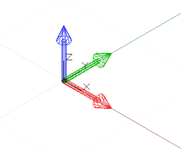
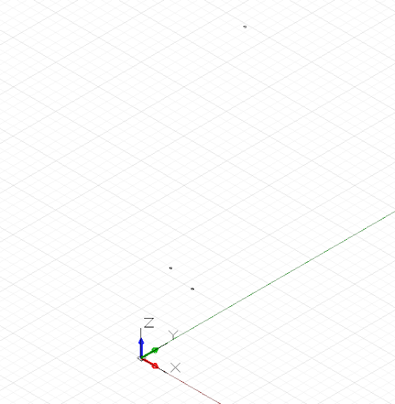

# 幾何基本型

雖然 Dynamo 能夠建立各種複雜幾何形狀，但是簡單的幾何基本型是構成任何計算設計的骨架：無論是以最終設計的形式直接表示，或是用來做為產生更複雜幾何圖形的鷹架。

雖然 CoordinateSystem 嚴格來說不算是一個幾何圖形，但卻是建構幾何圖形的一個重要工具。一個 CoordinateSystem 物件可以同時追蹤位置和幾何的轉換，例如旋轉、切變和調整比例。

建立一個中心點位於 x=0，y=0，z=0 的 CoordinateSystem (沒有旋轉、調整比例或切變轉換)，只需要呼叫 Identity 建構函式：



```js
// create a CoordinateSystem at x = 0, y = 0, z = 0,
// no rotations, scaling, or sheering transformations

cs = CoordinateSystem.Identity();
```

具有幾何轉換的 CoordinateSystems 超出本章節的範圍，不過有另一個建構函式 *CoordinateSystem.ByOriginVectors* 可以讓您在特定的點建立座標系統：


```js
// create a CoordinateSystem at a specific location,
// no rotations, scaling, or sheering transformations
x_pos = 3.6;
y_pos = 9.4;
z_pos = 13.0;

origin = Point.ByCoordinates(x_pos, y_pos, z_pos);
identity = CoordinateSystem.Identity();

cs = CoordinateSystem.ByOriginVectors(origin,
    identity.XAxis, identity.YAxis, identity.ZAxis);
```

最簡單的幾何基本型是一個點 (Point)，代表三維空間中的一個零維位置。如先前所述，在特定座標系統中建立一個點有幾種不同的方式：*ByCoordinates* 以指定的 x、y、z 座標建立一個點；*Point.ByCartesianCoordinates* 在特定座標系統中以指定的 x、y、z 座標建立一個點；*Point.ByCylindricalCoordinates* 在有半徑、旋轉角度和高度的圓柱上建立一個點；*Point.BySphericalCoordinates* 在有半徑和兩個旋轉角度的圓球上建立一個點。

本範例會顯示在各種座標系統建立的點：



```js
// create a point with x, y, and z coordinates
x_pos = 1;
y_pos = 2;
z_pos = 3;

pCoord = Point.ByCoordinates(x_pos, y_pos, z_pos);

// create a point in a specific coordinate system
cs = CoordinateSystem.Identity();
pCoordSystem = Point.ByCartesianCoordinates(cs, x_pos,
    y_pos, z_pos);

// create a point on a cylinder with the following
// radius and height
radius = 5;
height = 15;
theta = 75.5;

pCyl = Point.ByCylindricalCoordinates(cs, radius, theta,
    height);

// create a point on a sphere with radius and two angles

phi = 120.3;

pSphere = Point.BySphericalCoordinates(cs, radius, 
    theta, phi);
```

下一個較高維度的 Dynamo 基本型是直線，代表兩個端點之間有無限數目的點。使用 *Line.ByStartPointEndPoint* 建構函式明確指出兩個邊界點，或使用 *Line.ByStartPointDirectionLength* 建構函式指定起點、方向和沿著該方向的長度，可以建立直線。


```js
p1 = Point.ByCoordinates(-2, -5, -10);
p2 = Point.ByCoordinates(6, 8, 10);

// a line segment between two points
l2pts = Line.ByStartPointEndPoint(p1, p2); 

// a line segment at p1 in direction 1, 1, 1 with 
// length 10
lDir = Line.ByStartPointDirectionLength(p1,
    Vector.ByCoordinates(1, 1, 1), 10);
```

Dynamo 有幾個物件，代表三維的幾何基本型的最基本類型：使用 *Cuboid.ByLengths* 建立的立方體 (Cuboid)；使用 *Cone.ByPointsRadius* 和 *Cone.ByPointsRadii* 建立的圓錐 (Cone)；使用 *Cylinder.ByRadiusHeight* 建立的圓柱 (Cylinder)；以及使用 *Sphere.ByCenterPointRadius* 建立的圓球 (Sphere)。


```js
// create a cuboid with specified lengths
cs = CoordinateSystem.Identity();

cub = Cuboid.ByLengths(cs, 5, 15, 2);

// create several cones
p1 = Point.ByCoordinates(0, 0, 10);
p2 = Point.ByCoordinates(0, 0, 20);
p3 = Point.ByCoordinates(0, 0, 30);

cone1 = Cone.ByPointsRadii(p1, p2, 10, 6);
cone2 = Cone.ByPointsRadii(p2, p3, 6, 0);

// make a cylinder
cylCS = cs.Translate(10, 0, 0);

cyl = Cylinder.ByRadiusHeight(cylCS, 3, 10);

// make a sphere
centerP = Point.ByCoordinates(-10, -10, 0);

sph = Sphere.ByCenterPointRadius(centerP, 5);
```

