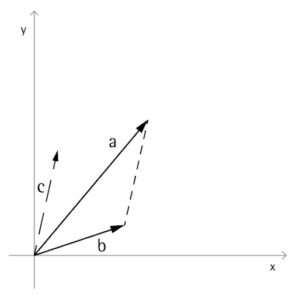

# 向量數學

計算設計中的物件很少會以其最終的位置和形狀明確建立，幾乎都是以既有的幾何圖形為基礎，將它們經過平移、旋轉，或以其他任何方式放在適當位置。向量數學是一種以幾何搭建鷹架的方式，對幾何圖形提供方向和方位，並且將整個 3D 空間的移動概念化而不提供視覺表現法。

從最基礎來說，一個向量代表 3D 空間中的一個位置，而且通常視為從位置 (0, 0, 0) 到該位置的一個箭頭的端點。向量可以使用 *ByCoordinates* 建構函式建立，採用新建立的 Vector 物件的 x、y、z 位置。請注意，Vector 物件不是幾何物件，不會出現在 Dynamo 視窗中。但是在主控台視窗中可以列印出新建立的向量或修改過的向量的相關資訊：


```
// construct a Vector object
v = Vector.ByCoordinates(1, 2, 3);

s = v.X + " " + v.Y + " " + v.Z;
```

Vector 物件定義了一組數學運算，讓您可以在 3D 空間中相加、相減、相乘，或以其他任何方式移動物件，就像您在 1D 空間中的數線上移動實數一樣。

向量相加是定義為兩個向量的分量總和，可以視為是兩個分量的向量箭頭以尖端接著尾端的方式放置而得到的向量。向量相加是使用 *Add* 方法執行，以左圖表示。


```
a = Vector.ByCoordinates(5, 5, 0);
b = Vector.ByCoordinates(4, 1, 0);

// c has value x = 9, y = 6, z = 0
c = a.Add(b);
```

同樣的，兩個 Vector 物件可以使用 *Subtract* 方法相減。向量相減可以視為是從第一個向量到第二個向量的方向。



```
a = Vector.ByCoordinates(5, 5, 0);
b = Vector.ByCoordinates(4, 1, 0);

// c has value x = 1, y = 4, z = 0
c = a.Subtract(b);
```

向量相乘可以視為將一個向量的終點沿著自己的方向移動給定的比例係數。


```
a = Vector.ByCoordinates(4, 4, 0);

// c has value x = 20, y = 20, z = 0
c = a.Scale(5);
```

如果要調整一個向量的大小，讓產生的向量長度完全等於調整的量，就經常會這樣做。只要先將一個向量正規化，也就是將向量的長度設定為等於 1，就可以輕鬆達成目標。


```
a = Vector.ByCoordinates(1, 2, 3);
a_len = a.Length;

// set the a's length equal to 1.0
b = a.Normalized();
c = b.Scale(5);

// len is equal to 5
len = c.Length;
```

c 還是指向與 (1, 2, 3) 相同的方向，但是現在長度等於 5。

向量數學中還有其他兩個與 1D 數學無關的方法，分別是叉積和內積。叉積是一種產生一個與兩個既有向量成正交 (90 度) 的向量的方法。例如，x 軸和 y 軸的叉積是 z 軸，不過兩個輸入向量不必然要互相正交。叉積向量使用 *Cross* 方法計算。


```
a = Vector.ByCoordinates(1, 0, 1);
b = Vector.ByCoordinates(0, 1, 1);

// c has value x = -1, y = -1, z = 1
c = a.Cross(b);
```

向量數學另外一個更進階的函數是內積。二個向量的內積是一個與兩個向量之間的角度有關但不是完全相同的一個實數 (不是 Vector 物件)。內積一個有用的性質是，如果兩個向量互相垂直，則兩個向量之間的內積將為 0。內積使用 *Dot* 方法計算。


```
a = Vector.ByCoordinates(1, 2, 1);
b = Vector.ByCoordinates(5, -8, 4);

// d has value -7
d = a.Dot(b);
```

