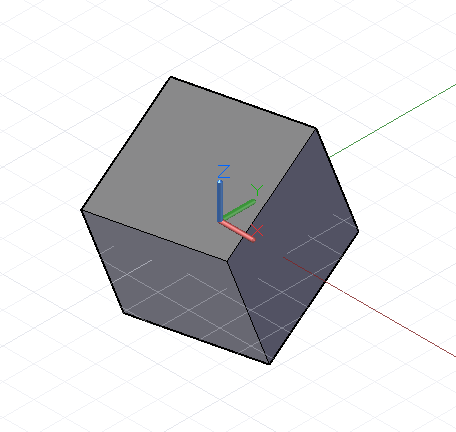

# 平移、旋轉和其他轉換

透過在三維空間中明確指出 x、y、z 座標，可以建立某些幾何圖形物件。但是，我們更常對物件本身或對其基本的 CoordinateSystem 使用幾何轉換，將幾何圖形移動到最終位置。

最簡單的幾何轉換是平移，亦即將一個物件沿著 x、y、z 方向移動指定的單位數。


```js
// create a point at x = 1, y = 2, z = 3
p = Point.ByCoordinates(1, 2, 3);

// translate the point 10 units in the x direction,
// -20 in y, and 50 in z
// p2’s new position is x = 11, y = -18, z = 53
p2 = p.Translate(10, -20, 50);
```

在 Dynamo 中，雖然可以在物件名稱的結尾附加 *.Translate* 方法平移所有物件，但是還有更複雜的轉換需要將物件從一個基本的 CoordinateSystem 轉換到新的 CoordinateSystem。例如，若要讓物件繞 x 軸旋轉 45 度，我們要使用 *.Transform* 方法，將物件從其既有無旋轉的 CoordinateSystem，轉換到一個已經繞 x 軸旋轉 45 度的 CoordinateSystem：



```js
cube = Cuboid.ByLengths(CoordinateSystem.Identity(),
    10, 10, 10);

new_cs = CoordinateSystem.Identity();
new_cs2 = new_cs.Rotate(Point.ByCoordinates(0, 0),
    Vector.ByCoordinates(1,0,0.5), 25);

// get the existing coordinate system of the cube
old_cs = CoordinateSystem.Identity();

cube2 = cube.Transform(old_cs, new_cs2);
```

除了平移和旋轉，也可以用調整比例或切變方式建立 CoordinateSystem。CoordinateSystem 可以使用 *.Scale* 方法調整比例：


```js
cube = Cuboid.ByLengths(CoordinateSystem.Identity(),
    10, 10, 10);

new_cs = CoordinateSystem.Identity();
new_cs2 = new_cs.Scale(20);

old_cs = CoordinateSystem.Identity();

cube2 = cube.Transform(old_cs, new_cs2);
```

在 CoordinateSystem 建構函式中輸入非正交的向量可以建立切變的 CoordinateSystem。


```js
new_cs = CoordinateSystem.ByOriginVectors(
    Point.ByCoordinates(0, 0, 0),
	Vector.ByCoordinates(-1, -1, 1),
	Vector.ByCoordinates(-0.4, 0, 0));

old_cs = CoordinateSystem.Identity();

cube = Cuboid.ByLengths(CoordinateSystem.Identity(), 
    5, 5, 5);

new_curves = cube.Transform(old_cs, new_cs);
```

比起旋轉和平移，調整比例和切變是相對比較複雜的幾何轉換，所以並非每個 Dynamo 物件都能經過這些轉換。下表概述哪些 Dynamo 物件可以有非等比例調整的 CoordinateSystem，以及切變的 CoordinateSystem。

|類別|非等比例調整的 CoordinateSystem|切變的 CoordinateSystem|
| -- | -- | -- |
|Arc|否|否|
|NurbsCurve|是|是|
|NurbsSurface|否|否|
|Circle|否|否|
|Line|是|是|
|Plane|否|否|
|Point|是|是|
|Polygon|否|否|
|Solid|否|否|
|Surface|否|否|
|Text|否|否|

