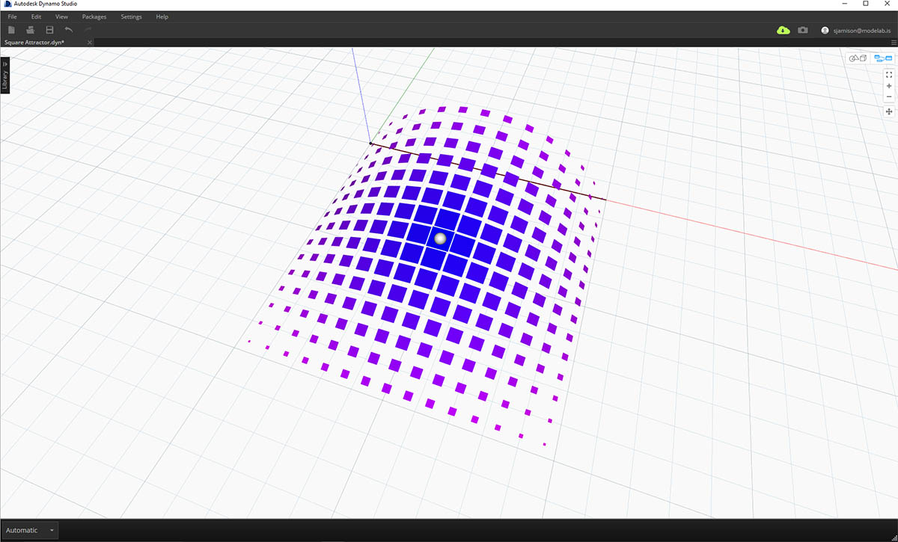
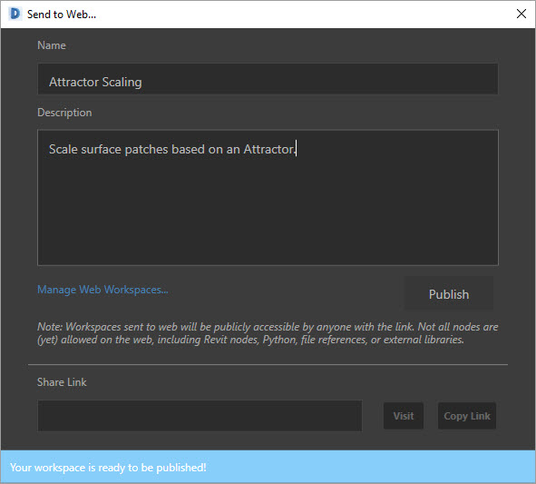
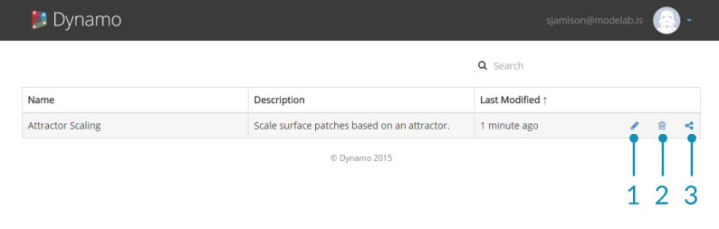

## 傳送至 Web (使用 Dynamo Studio)

使用 Dynamo Studio 可快速輕鬆地將檔案發送至 Web。但是，您可能要花費一些時間，以選取您的輸入並對其新增標籤，以使您的檔案使用者友善。如果您需要下載 Dynamo Studio，請造訪 [Autodesk 網站](http://www.autodesk.com/products/dynamo-studio/overview)，以取得更多資訊。

### 練習 ： 準備「傳送至 Web」

> 下載本練習的範例檔案 (按一下右鍵，然後按一下「鏈結另存為... 」)。附錄中提供範例檔案的完整清單。[下載吸引子比例範例](datasets/Attractor Scale.dyn)

在本練習中，我們會將 Dynamo 圖表發佈至 Web。此檔案會建立一個矩形網格，根據吸引子進行縮放並從底部對映至目標表面。會從每個矩形建立表面填充並根據其與吸引子的距離進行著色。

> 這是我們將開發的自訂程式。 在 [Web](https://dynamo.autodesk.com/share/572a49033a47345a0407e803) 上檢視此示例。

若要準備 Script 以進行發佈，請先決定哪些輸入可供使用者存取。允許的輸入包括滑塊、數字、字串、布林值。程式碼區塊與檔案路徑不能作為輸入。透過任何輸入上的環境定義功能表來關閉「輸入」，以使其不顯示在自訂程式視圖中。確保所有滑塊輸入具有合理的最小值和最大值。

> 透過任何輸入上的環境定義功能表來取消選中「輸入」，以使其不顯示在自訂程式中。

其次，確保您的輸入清楚地添加了標籤。

> 透過按兩下節點名稱對其進行編輯以為輸入添加標籤。

包括預覽幾何圖形，使您的 Script 易於瞭解。在此範例中，圓球表示吸引子位置，且表面根據其與吸引子的距離進行著色。這可讓吸引子之影響的可視性更高且更易於理解。

### 發佈檔案

當您已準備好發佈您的檔案時，請從「檔案」功能表中選取「傳送至 Web」。

輸入檔案說明以及開始發佈時所需的任何指示。檔案發佈後，您可以傳送鏈結至任何擁有 Autodesk 帳戶的使用者。將使用當前輸入值和預覽來發佈檔案。

> 在 [Web](https://dynamo.autodesk.com/share/572a49033a47345a0407e803) 上檢視此範例

### 管理所發佈檔案

要管理所發佈的 Scripts，請造訪 [https://dynamo.autodesk.com](https://dynamo.autodesk.com) 並登入至您的帳戶。 從頂部的下拉式清單中選取「管理」。在此頁面上，您可以編輯、共用或刪除已發佈的工作區。此頁也可透過 Dynamo Studio 檔案功能表中的「管理 Web 工作區」進行訪問。

> 1. 編輯工作區
2. 刪除工作區
3. 共用鏈結

