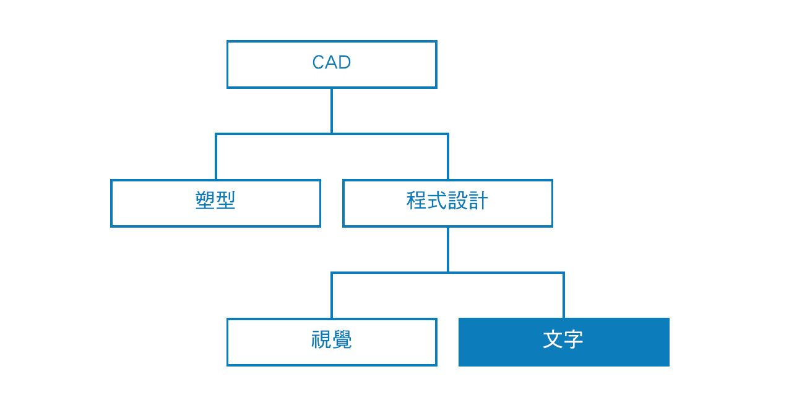
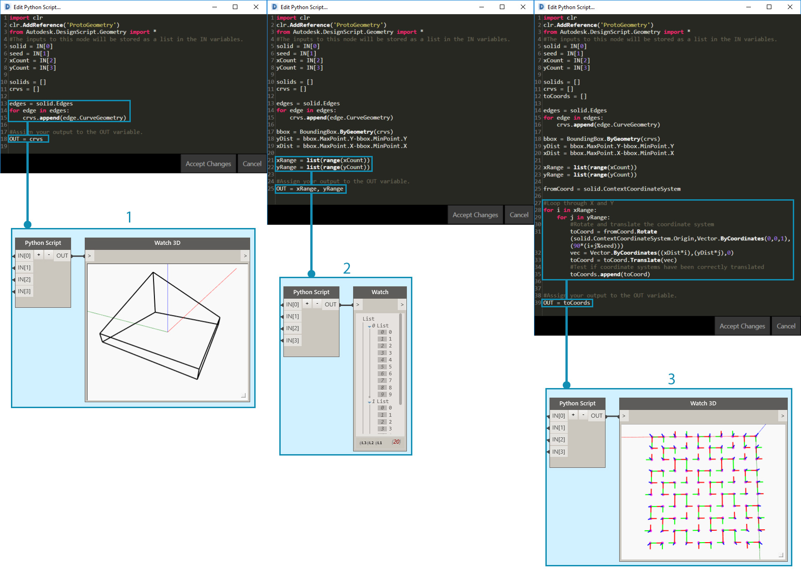
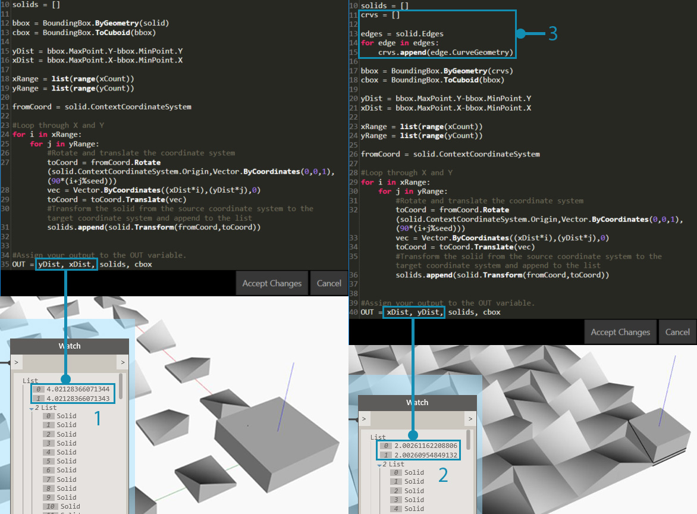

## 撰寫腳本策略

使用 DesignScript、Python 和 ZeroTouch (C#)在可視腳本環境中進行文字腳本撰寫，可建立功能強大的視覺關係。使用者可以在相同的工作區內執行以下所有作業：顯示如輸入滑棒等的元素、將大型作業壓縮並輸入至 DesignScript，以及透過 Python 或 C# 存取功能強大的工具和資源庫。如果有效管理，結合這些策略可為整體程式增添極大的自訂成份、透明度和效率。以下是一組準則，可協助您利用文字腳本擴充您的視覺腳本。



### 瞭解應何時撰寫腳本

與視覺程式設計相比，文字腳本更能建立較高複雜性的關係，但兩者的功能也明顯重疊。這是合理的，因為節點是預先封裝的程式碼，而我們或許可以將整個 Dynamo 程式寫入 DesignScript 或 Python。但是，由於節點介面和線材建立直覺式流程的圖形資訊，因此我們仍然使用可視腳本。瞭解文字腳本比可視腳本優勝的地方，可以幫助您瞭解應何時使用它，而又同時保留節點和線材的直覺式屬性。以下是有關何時撰寫腳本和使用哪種方式的準則。

**在以下情況使用文字腳本：**

* 循環播放

* 遞迴

* 存取外部資源庫

**選擇一種方式：**

|
|循環播放|遞迴|壓縮節點|直徑 資源庫|速記|
| -- | -- | -- | -- | -- | -- |
|**DesignScript**|是|是|是|否|是|
|**Python**|是|是|局部|是|否|
|**ZeroTouch (C#)**|否|否|否|是|否|

> 請參閱 [腳本參考](http://primer.dynamobim.org/en/12_Best-Practice/12-3_Scripting-Reference.html) 以瞭解每個 Dynamo 資源庫可以讓您存取的功能。

### 參數化

當使用 Dynamo 撰寫腳本時，在這個必然參數式的環境中適宜組織您的程式碼，使其與它將處於的節點和線材的架構相對。請將包含您文字腳本的節點當做為程式中的任何其他節點，它有一些特定輸入、函數和預期的輸出。這讓節點內部的程式碼獲得一小組可讓您工作的變數，從而獲得一個清晰的參數式系統。以下是如何更好的整合程式碼至視覺程式中的指導方針。

**識別外部變數：**

* 嘗試確定在您的設計問題中的指定參數，以便您可以直接使用該資料建置模型。

* 撰寫程式碼之前，請先識別變數：

* 最小組輸入

* 預期的輸出

* 常數


> 撰寫程式碼之前已建立多個變數。

> 1. 我們將模擬降雨的曲面。
2. 我們所需的雨滴數量 (劑)。
3. 我們希望的降雨路程。
4. 在沿著最陡峭的路徑下降與穿過曲面之間切換。
5. Python 節點與其輸入數量。
6. 使傳回的曲線變為藍色的 Code Block。

**設計內部關係：**

* 參數化允許對某些參數或變數進行編輯，以操控或變更方程式或系統的最終結果。

* 只要腳本中的圖元都是邏輯性相關，嘗試將它們定義為對方的函數。如果使用此方法，當其中一個圖元被修改，餘下的一個可以按比例更新。

* 透過僅顯示關鍵參數來最小化輸入的數量：

* 如果參數集可以來自多個父系參數，僅展示父系參數為指令輸入。這會減少您的腳本介面的複雜性，從而增加其可用性。


> 來自 [Python 節點](http://primer.dynamobim.org/en/09_Custom-Nodes/9-4_Python.html)中的範例的「模組」程式碼。

> 1. 輸入。
2. 腳本內部的變數。
3. 使用這些輸入及變數來執行其功能的迴路。
> 秘訣：強調製程，如同您強調解決方案一樣。

**不要重複自己 (「DRY」原則)：**

* 當您可以在腳本中使用多種方式表達同一點，重複的表現法將會不同步，這可導致令人煩惱的維護、不良係數和內部矛盾。

* 「DRY」原則是「系統中的每個知識必須具有單一、清晰和權威性的表現法」：

* 當成功套用此原則時，腳本中的所有相關元素會有預測性地均勻變更，而不相關的元素之間則不會有邏輯性的後果。

```
### BAD
for i in range(4):
for j in range(4):
point = Point.ByCoordinates(3*i, 3*j, 0)
points.append(point)
```

```
### GOOD
count = IN[0]
pDist = IN[1]

for i in range(count):
for j in range(count):
point = Point.ByCoordinates(pDist*i, pDist*j, 0)
points.append(point)
```

> 秘訣：在腳本中複製圖元前 (例如上述範例中的「固定」)，先檢查是否可以連結至來源。

### 模組化結構

當您的程式碼變得更長、「構想」變得更複雜，或總體演算法變得更難以辨認。追蹤特定作業的發生 (及在哪裡發生)、尋找錯誤、整合其他程式碼和指定開發工作時將會變得更因難。若要避免這些麻煩，應該將程式碼撰寫成模組型態，這是根據執行的工作來拆分程式碼的組織策略。以下是透過模組化使您的腳本更易於管理的一些秘訣。

**將程式碼撰寫成模組型態：**

* 「模組」是執行特定工作的群組碼，類似於工作區的 Dynamo 節點。

* 這可以是任何需要在視覺上從相鄰程式碼分離的內容 (函數、類別、一組輸入，或您要匯入的資源庫)。

* 在模組中開發程式碼這一方法利用節點的視覺品質和直覺式品質，以及僅透過文字腳本可以獲得的複雜關係。


> 這些迴路呼叫命名為「代理」的類別，我們將在練習中開發。

> 1. 定義每個代理起點的程式碼模組。
2. 更新代理程式的程式碼模組。
3. 為代理程式的路徑繪製一條系統線的程式碼模組。

**發現重複使用的程式碼：**

* 如果您發現您的程式碼在不同的地方做同樣 (或非常類似) 的事情，應尋找方法把它叢集為可以呼叫的函數。

* 「管理員」函數控制程式流程和主要包含對處理低級詳細資料的「工作者」函數的呼叫，例如在結構之間移動資料。


> 本範例會建立根據中心點的 Z 值所設的圓球半徑和顏色。

> 1. 兩個「工作者」父系函數：建立圓球半徑和顯示以中心點的 Z 值為基礎的顏色。
2. 結合兩個工作者函數的「管理員」父系函數。呼叫此父系函數時將一同呼叫包含在其內的兩個函數。

**僅展示需要顯示的東西：**

* 模組介面表示模組提供與所需的元素。

* 當定義好單位之間的介面時，每個單位的詳細設計可以分開繼續。

**可分離性/可取代性：**

* 模組並不知道彼此的存在。

**模組化的一般形式：**

* 群組程式碼：

```
# IMPORT LIBRARIES
import random
import math
import clr
clr.AddReference('ProtoGeometry')
from Autodesk.DesignScript.Geometry import *

# DEFINE PARAMETER INPUTS
surfIn = IN[0]
maxSteps = IN[1]
```

* 函數：

```
def get_step_size():
area = surfIn.Area
stepSize = math.sqrt(area)/100
return stepSize

stepSize = get_step_size()
```

* 類別：

```
class MyClass:
i = 12345

def f(self):
return 'hello world'

numbers = MyClass.i
greeting = MyClass.f
```

### 連續地調整

在 Dynamo 開發文字腳本時，應時常確定您所實際建立的與您的要求相符。這將確保意外事件 -- 語法錯誤、邏輯差異、值錯誤、異常的輸出等 -- 一旦發生時，能被迅速發現及處理，而不是到最後才獲得處理。因為文字腳本位於圖元區上的節點內部，它們已經整合到視覺程式的資料流。這使您的腳本的連續監視變得十分簡單：包括分配要輸出的資料、執行程式，以及使用 Watch 節點計算流出腳本的內容。以下是在建構腳本時不斷檢查它們的一些秘訣。

**建構時同時進行測試：**

* 每當您完成叢集函數時：

* 停下來，並檢查您的程式碼。

* 好好地審視它。協同合作者是否能瞭解此作業？我是否需要執行此作業？此函數是否可以更有效率地完成？我是否建立了不必要的複本或相依性？

* 進行快速測試，以確定它傳回「有意義」的資料。

* 指定腳本中最近使用的資料為輸出，以使腳本更新時節點永遠輸出相關的資料：



> 調整 [Python 節點](http://primer.dynamobim.org/en/09_Custom-Nodes/9-4_Python.html)的範例程式碼。

> 1. 檢查實體的所有邊以曲線方式傳回，以建立一個邊界框。
2. 檢查已將計數輸入成功轉換為範圍。
3. 檢查此迴路的座標系統已正確轉換與旋轉。

**預期「極端情形」：**

* 撰寫腳本時，將您的輸入參數設定為其指定範圍的最小值和最大值，以檢查程式在極端情形下是否仍能正常運作。

* 即使程式在極端情形下仍能正常運作，請檢查其是否正在傳回非預期的 null/空白/零值。

* 有時候，反映腳本某些基本問題的錯誤僅會在這些極端情形下出現。

* 瞭解錯誤的成因，然後決定是否需要進行內部的修正，或是需要重新定義某個參數範圍以避免此問題。

> 秘訣：永遠假定使用者將使用他/她可得到的每一個輸入值的每個組合。這樣有助於避免不必要的意外。

### 有效除錯

除錯是從腳本中消除「錯誤」的過程。錯誤可能是誤差、低效率、不精確，或任何非預期的結果。解決錯誤可以是簡單地修正拼錯的變數名稱，或者是腳本中更普遍的結構問題。在理想狀態下，建置腳本時同時調整它可以幫助及早發現這些潛在問題，但這不能保證腳本沒有錯誤。以下是對上述幾個最佳做法的回顧，以協助您有系統地解決錯誤。

**使用觀看標示圈：**

* 透過將程式碼指定給 OUT 變數，檢查傳回至程式碼不同位置的資料，類似於調整程式的概念。

**寫入有意義的註釋：**

* 如果清楚說明了預期結果，程式碼的模組將會更容易除錯。

```
# Loop through X and Y
for i in range(xCount):
for j in range(yCount):

# Rotate and translate the coordinate system
toCoord = fromCoord.Rotate(solid.ContextCoordinateSystem.Origin,Vector.ByCoordinates(0,0,1),(90*(i+j%seed)))
vec = Vector.ByCoordinates((xDist*i),(yDist*j),0)
toCoord = toCoord.Translate(vec)

# Transform the solid from the source coord system to the target coord system and append to the list
solids.append(solid.Transform(fromCoord,toCoord))
```

> 這通常會產生過度的註解和空白行，但除錯時將事情分解成可管理的部分則更為有效。

**利用程式碼的模組性：**

* 問題的根源可以追溯到某些模組。

* 一旦識別錯誤的模組，修正問題就會較為簡單。

* 如果必須修改程式，就可以更輕鬆地變更開發成為模組的程式碼：

* 您可以將新或已除錯的模組插入至既有的程式，而不必擔心程式的其他部分會變更。



> 在 [Python 節點](http://primer.dynamobim.org/en/09_Custom-Nodes/9-4_Python.html)的範例檔案中進行除錯。

> 1. 當指定 xDist 和 yDist 至 OUT 時，我們可以看到輸入幾何圖形會傳回一個大於自己的邊界框。
2. 輸入幾何圖形的邊的曲線會傳回合適的邊界框和 xDist 和 yDist 的正確距離。
3. 我們為解決 xDist 和 yDist 值的問題而插入的「模組」程式碼。

### 練習 - 最陡的路徑

> 下載此練習隨附的範例檔案 (按一下右鍵，然後按一下「連結另存為...」)。附錄中提供範例檔案的完整清單。[SteepestPath.dyn](datasets/13-1/SteepestPath.dyn)

使用文字腳本的最佳實踐，讓我們先寫入降雨模擬的腳本。雖然我們可以在圖表策略中將最佳實踐套用至缺乏條理的視覺程式，但要將最佳實踐套用至文字腳本則難得多。在文字腳本中建立的邏輯關係不太明顯，並且幾乎無法在混亂的程式碼中解開。文字腳本的強大功能意味著需要更多的組織。我們會檢視每個步驟並套用最佳實踐。


> 我們的腳本套用至吸子變形曲面。

我們首先需要匯入必要的 Dynamo 資源庫。首先執行此作業可取得 Python 中對 Dynamo 功能的整體存取。


> 我們需要將想使用的所有資源庫匯入至此處。

接下來，我們需要定義腳本的輸入和輸出，它將顯示為節點上的輸入連接埠。這些外部輸入是腳本的基礎，以及建立參數式環境的關鍵。


> 我們需要定義相對應 Python 腳本中的變數的輸入，並決定所需輸出：

> 1. 我們想要漫遊的曲面。
2. 我們想要漫遊的代理程式數目。
3. 允許代理程式的最大步數。
4. 以最短路徑漫遊或橫過曲面的選項。
5. Python 節點的輸入識別碼與腳本中的輸入對應 (IN[0], IN[1])。
6. 輸出曲線可使用不同的顏色顯示。

現在，讓我們採用模組化的做法，並建立腳本的本體。模擬從多個起點漫遊曲面的最短路徑是一項重要的工作，將需要多個功能。我們可以透過收集程式碼到單一類別 (代理程式) 來將程式碼模組化，而不需要呼叫整個腳本中不同的函數。此類別的不同函數或「模組」可以使用不同的變數呼叫，或可以重複用於其他腳本。


> 我們必須為代理程式定義一個類別或藍圖，以便它每走一步時均選擇最陡的方向向下漫遊曲面：

> 1. 名稱。
2. 所有代理程式共用的整體屬性。
3. 每個代理程式唯一的例證屬性。
4. 行走一步的函數。
5. 將每步位置編入至系統線清單的函數。

讓我們來定義代理程式的起點位置並初始化它們。這是一個很好的機會去調整腳本，並確保代理程式類別有效。


> 我們將需要例證化所有我們要觀察它漫遊曲面的代理程式，並定義其初始屬性：

> 1. 新的空白系統線清單。
2. 在曲面上開始其路程的位置。
3. 我們已指定代理程式清單為輸出，以檢查腳本會傳回甚麼。傳回的代理程式數目正確，但稍後我們將需要再次調整腳本，以確認其將傳回的幾何圖形。

在每個步驟更新每個代理程式。


> 然後，我們將需要為每個代理程式及每個步驟輸入巢狀迴路，並且更新和記錄它們的位置至其系統線清單。每個步驟中，我們也將確定代理程式始終能夠在曲面上保持行走 (以允許其下降)。如果該條件已滿足，我們將終止代理程式的路程。

我們的代理程式已完全更新，現在讓我們傳回代表它們的幾何圖形。


> 當所有代理程式已達到它們的下降限制或最大步數，我們將透過其系統線清單中的點建立 polycurve，並輸出 polycurve 系統線。

尋找最陡路徑的腳本。


> 1. 可在基本曲面上模擬降雨的預置。
2. 代理程式可被切換以橫過基本曲面，而不需尋找最陡的路徑。


> 完整的 Python 文字腳本。

