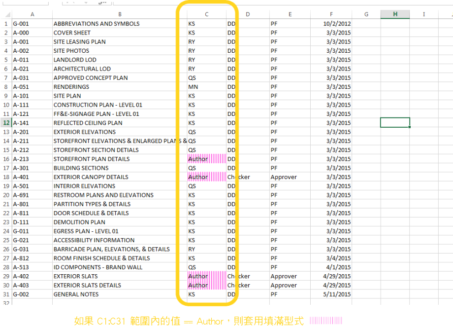
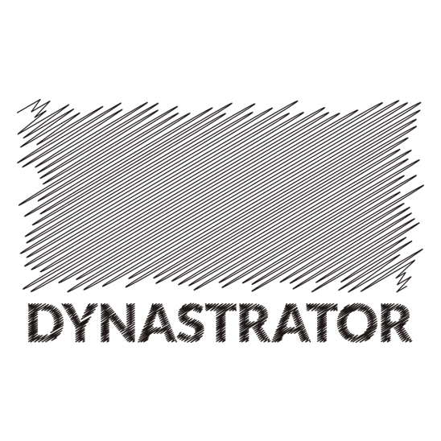
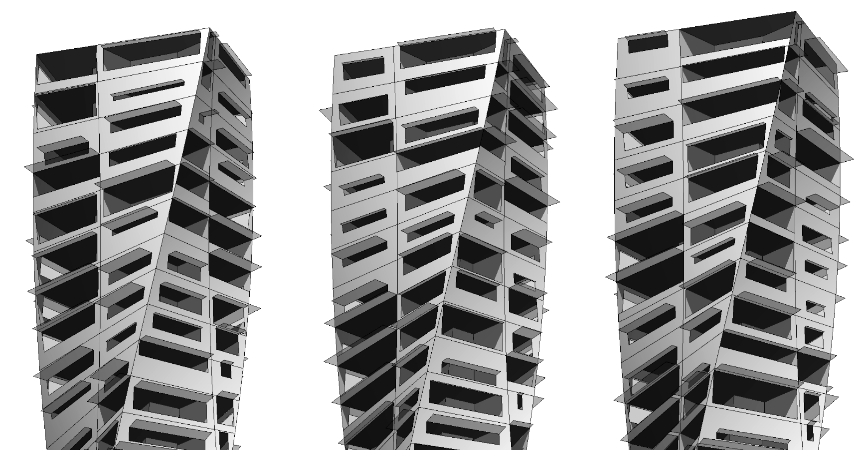

## Dynamo 套件

以下是 Dynamo 社群中一些較常用套件的清單。開發人員，請加入至清單！請記住，[Dynamo Primer](https://github.com/DynamoDS/DynamoPrimer) 是開放原始碼產品！

||ARCHI-LAB|[造訪官方 archi-lab 網站](http://archi-lab.net/)|
| -- | -- | -- |
|archi-lab 是超過 50 種自訂套件的集合，可大幅提升 Dynamo 與 Revit 互動的能力。archi-lab 套件中包含的節點各不相同，從基本清單作業到 Revit 的進階分析可視化框架節點，不一而足。||

||BUMBLEBEE FOR DYNAMO|[造訪官方 BumbleBee 網站](http://archi-lab.net/bumblebee-dynamo-and-excel-interop/)|
| -- | -- | -- |
|Bumblebee 是實現 Excel 與 Dynamo 之間互通性的外掛程式，可大幅提升 Dynamo 讀取及寫入 Excel 檔案的能力。||

||CLOCKWORK FOR DYNAMO|[造訪 Clockwork For Dynamo GitHub](https://github.com/CAAD-RWTH/ClockworkForDynamo)|
| -- | -- | -- |
|Clockwork 是適用於 Dynamo 視覺程式設計環境的自訂節點集合。它不但包含許多 Revit 相關節點，還包含許多適用於諸如以下各種其他用途的節點：清單管理、數學作業、字串作業，單位轉換、幾何作業 (主要是邊界框、網面、平面、點、曲面、UV 與向量) 及面板化。||

||DYNAMO SAP|[在核心工作室造訪 DynamoSAP 專案](http://core.thorntontomasetti.com/dynamosap-is-now-open-source/)|
| -- | -- | -- |
|DynamoSAP 是在 Dynamo 基礎上建置的適用於 SAP2000 的參數式介面。藉由該專案，設計師與工程師能以高生產力的方式建立及分析 SAP 中的結構系統，同時使用 Dynamo 來驅動 SAP 模型。該專案指定了一些通用工作流程 (在隨附的範例檔案中對這些工作流程進行了描述)，並提供在 SAP 中自動執行典型工作的諸多機會。||

||DYNAMO UNFOLD|[造訪 DynamoUnfold GitHub](https://github.com/mjkkirschner/DynamoUnfold)|
| -- | -- | -- |
|藉由此資源庫，使用者可以展開曲面與 polysurface 幾何圖形，從而延伸 Dynamo/Revit 的功能。藉由該資源庫，使用者可以先將曲面轉換為平面嵌合拓樸，然後使用 Dynamo 中的 ProtoGeometry 工具將其展開。此套件還包括一些實驗節點與一些基本範例檔案。||

||DYNASTRATOR|[在 Package Manager 下載 Dynastrator](http://dynamopackages.com/)|
| -- | -- | -- |
|使用 .svg 從 Illustrator 或網路匯入向量作品。您可藉此將手動建立的圖面匯入至 Dynamo 以執行參數式作業。||

||ENERGY ANALYSIS FOR DYNAMO|[在 GitHub 上造訪 Energy Analysis for Dynamo 專案](https://github.com/tt-acm/EnergyAnalysisForDynamo)|
| -- | -- | -- |
|藉由 Energy Analysis for Dynamo，可以在 Dynamo 0.8 中執行參數式能源塑型與整棟建築的能源分析工作流程。藉由 Energy Analysis for Dynamo，使用者可以在 Autodesk Revit 中設定能源模型，提交至 Green Building Studio 進行 DOE2 能源分析，然後深入研究分析傳回的結果。此套件的開發者是 Thornton Tomasetti 的核心工作室。||

||FIREFLY FOR DYNAMO|[在 Dynamo Package Manager 下載 Firefly](http://dynamopackages.com/)|
| -- | -- | -- |
|Firefly 是節點的集合，藉由這些節點，Dynamo 可以與輸入/輸出裝置 (例如 Arduino 微控制器) 通訊。由於會「即時」發生資料流動，因此 Firefly 會為透過網路攝影機、行動電話、遊戲控制器、感應器等在數位與實體環境之間進行互動式原型開發帶來許多機會。||

||LUNCHBOX FOR DYNAMO|[在試驗場檢驗 Lunchbox for Dynamo](http://provingground.io/tools/lunchbox/)|
| -- | -- | -- |
|LunchBox 是可重複使用的幾何圖形及資料管理節點的集合。這些工具已通過搭配使用 Dynamo 0.8.1 與 Revit 2016 的測試。工具包括用於曲面面板化的節點、幾何圖形、Revit 資料集合等！||

||MANTIS SHRIMP|[造訪官方 Mantis Shrimp 網站。](http://archi-lab.net/mantis-shrimp-getting-started/)|
| -- | -- | -- |
|Mantis Shrimp 是互通性專案，您可藉此將 Grasshopper 及/或 Rhino 幾何圖形輕鬆匯入至 Dynamo。||

||MESH TOOLKIT|[造訪 Dynamo Mesh Toolkit GitHub](https://github.com/DynamoDS/Dynamo/wiki/Dynamo-Mesh-Toolkit)|
| -- | -- | -- |
|Dynamo Mesh Toolkit 可提供對網面幾何圖形進行處理的許多有用工具。此套件的功能包括匯入外部檔案格式的網面、根據預先存在的 Dynamo 幾何圖形物件產生網面，以及根據頂點與連接資訊手動建置網面。此外，該工具套件還包括用於修改及修復網面幾何圖形的工具。||

||OPTIMO|[造訪 Optimo GitHub](https://github.com/BPOpt/Optimo/wiki/0_-Home)|
| -- | -- | -- |
|藉由 Optimo，Dynamo 使用者可以使用各種演化演算法，以最佳化自己定義的設計問題。使用者可以定義問題目標或目標組，以及特定的健康度函數。||

||RHYNAMO|[造訪 Rhynamo Bitbucket](https://bitbucket.org/caseinc/rhynamo)|
| -- | -- | -- |
|藉由 Rhynamo 節點資源庫，使用者可以在 Dynamo 內，讀取及寫入 Rhino 3DM 檔案。Rhynamo 透過使用 McNeel 的 OpenNURBS 資源庫，可以採用能在 Rhino 與 Revit 之間順利交換幾何圖形及資料的新工作流程，從而將 Rhino 幾何圖形轉換為可使用的 Dynamo 幾何圖形。此套件也包含一些實驗節點，藉此可「即時」存取 Rhino 指令行。||

||RHYTHM|[在 GitHub 上造訪 Rhythm](https://github.com/sixtysecondrevit/RhythmForDynamo)|
| -- | -- | -- |
|初看 Rhythm 並無特殊之處。它不包含任何複雜的程式碼或類似內容。但是，Rhythm 展示出務實的思考與勤勉。此套件的構想可協助使用者在 Revit 中保持 Rhythm 與 Dynamo 共存。Rhythm 主要包含現成的 Dynamo 節點，使用者將這些節點套用至 Revit 環境時可以熟練使用。||

